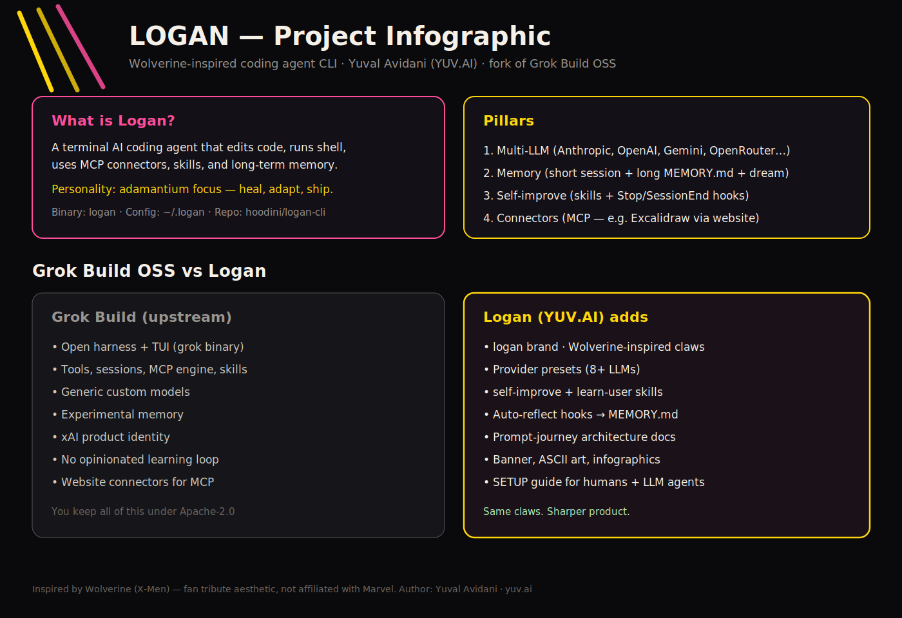
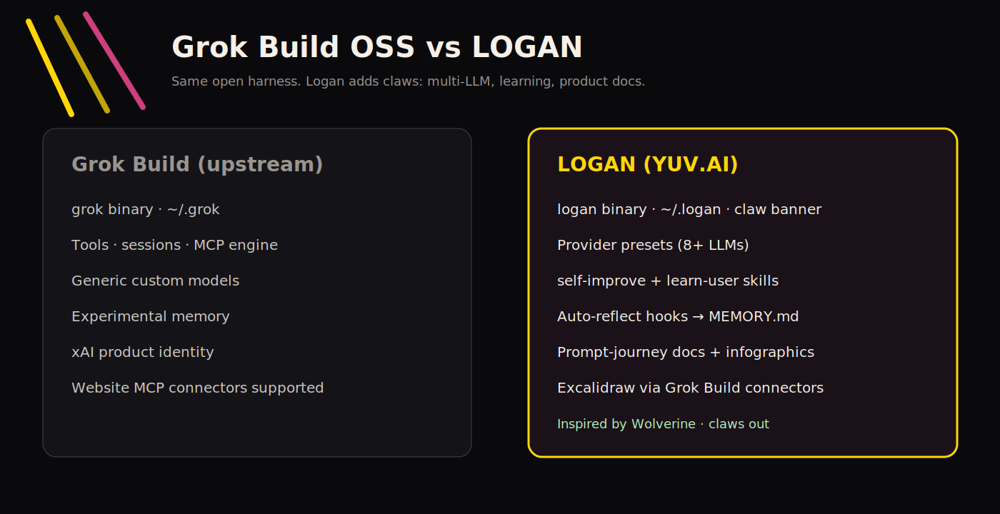

<p align="center">
  
</p>

<pre align="center">
    \\  \\  \\
     \\  \\  \\      L O G A N
      \\  \\  \\     coding agent CLI
       V   V   V     inspired by Wolverine · by Yuval Avidani (YUV.AI)
  ═══════════════════════════════════════
  multi-LLM · memory · self-improve · MCP
</pre>

<h1 align="center">Logan <code>logan</code></h1>

<p align="center">
  <strong>Terminal AI coding agent</strong> by
  <a href="https://yuv.ai"><strong>Yuval Avidani</strong></a> (YUV.AI) - AI Builder &amp; Speaker
  <br/>
  Inspired by <strong>Wolverine</strong> - heal, adapt, claws out for hard bugs.
  <br/>
  Fork of <a href="https://github.com/xai-org/grok-build">xAI Grok Build</a> (Apache-2.0)
</p>

<p align="center">
  <a href="https://github.com/hoodini/logan-cli"></a>
  <a href="docs/SETUP.md"></a>
  <a href="docs/COMPARISON.md"></a>
  <a href="#prompt-journey-how-a-prompt-is-processed"></a>
  <a href="LICENSE"></a>
</p>

```sh
logan --version
# Logan TUI by Yuval Avidani (YUV.AI) - https://yuv.ai
```

| | |
| --- | --- |
| Web | [yuv.ai](https://yuv.ai) |
| X | [@yuvalav](https://x.com/yuvalav) |
| GitHub | [@hoodini](https://github.com/hoodini) |
| Instagram | [@yuval_770](https://instagram.com/yuval_770) |
| Linktree | [linktr.ee/yuvai](https://linktr.ee/yuvai) |

---

## Prompt journey (how a prompt is processed)

This is the core of Logan. **Every user message follows this path:**

<p align="center">
  
</p>

<p align="center">
  
</p>

```text
1. YOU TYPE          TUI prompt / headless -p / ACP editor
        |
        v
2. CLI PARSE         logan binary (clap) · cwd · model · flags
        |
        v
3. SESSION ACTOR     handle_prompt · slash commands · skill rewrite
        |
        v
4. BUILD REQUEST     ChatStateActor · history · prune tool results (~50%)
        |
        v
5. SYSTEM PROMPT     layers stacked (see below) + tool schemas
        |
        v
6. SAMPLER (LLM)     chat_completions | responses | messages
                     Anthropic · OpenAI · Gemini · OpenRouter · Ollama · …
        |
        v
7. TOOL LOOP         edit · shell · search · MCP · skills
                     repeat until end_turn
        |
        v
8. STREAM + LEARN    TUI stream · updates.jsonl
                     Stop/SessionEnd hooks → MEMORY.md
                     /flush · self-improve · autoDream
```

### What goes into the system prompt (step 5)

| Layer | Content |
| --- | --- |
| 1 | Base template - **Logan** identity, safety, tool rules |
| 2 | API **tool schemas** (often the largest token cost) |
| 3 | **Skills** catalog (budgeted names + descriptions) |
| 4 | Project rules - `AGENTS.md` / `Claude.md` / `.logan/rules` |
| 5 | **Memory** tools + first-turn `<memory-context>` |
| 6 | Role / persona / custom overrides |
| 7 | **Preferences + lessons** from long-term MEMORY.md |

There is **no fixed system-prompt length** - it grows with tools, skills, and rules.
Context window: prune ~50% · auto-compact ~85%.

Deep dive: [docs/architecture/ARCHITECTURE.md](docs/architecture/ARCHITECTURE.md)  
Excalidraw: [docs/architecture/01-prompt-lifecycle.excalidraw](docs/architecture/01-prompt-lifecycle.excalidraw)

---

## Grok Build OSS vs Logan

<p align="center">
  
</p>

<p align="center">
  
</p>

| | Grok Build OSS | **Logan** |
| --- | --- | --- |
| Binary | `grok` | **`logan`** |
| Config | `~/.grok` | **`~/.logan`** |
| Identity | xAI / Grok | **YUV.AI · Wolverine-inspired** |
| Multi-LLM presets | Manual only | **8+ providers ready** |
| Learning loop | No product loop | **skills + auto-reflect hooks** |
| Prompt-journey docs | Fragmented | **README + infographics + Excalidraw** |
| Harness (tools/MCP/sessions) | Yes | **Yes (inherited)** |

Full matrix: **[docs/COMPARISON.md](docs/COMPARISON.md)**

---

## Quick start

```bash
git clone https://github.com/hoodini/logan-cli.git && cd logan-cli
source "$HOME/.cargo/env"   # rustup install if needed
cargo build -p xai-grok-pager-bin --release
cp target/release/logan ~/.local/bin/logan
export PATH="$HOME/.local/bin:$PATH"

mkdir -p ~/.logan
cat examples/config/providers.toml >> ~/.logan/config.toml
# set [models] default = "claude-sonnet" (or openai / ollama / …)
export ANTHROPIC_API_KEY="…"   # or OPENAI_API_KEY / OPENROUTER_API_KEY / …

# memory + learning
# [memory] enabled = true in config
cp examples/config/USER_PREFERENCES.template.md ~/.logan/memory/MEMORY.md
mkdir -p ~/.logan/hooks/bin
cp examples/hooks/auto-reflect.json ~/.logan/hooks/
cp examples/hooks/bin/auto-reflect.py ~/.logan/hooks/bin/
chmod +x ~/.logan/hooks/bin/auto-reflect.py

logan --version
logan -p "Say logan-ok"
```

**Full setup (humans + LLM agents installing Logan):** [docs/SETUP.md](docs/SETUP.md)

---

## Multi-provider LLMs

| Provider | How |
| --- | --- |
| Anthropic | `api_backend = "messages"` |
| OpenAI | `chat_completions` / `responses` |
| Gemini | OpenAI-compat URL |
| OpenRouter | `openrouter.ai/api/v1` |
| Ollama / LM Studio | localhost OpenAI-compat |
| Bedrock | via LiteLLM proxy |

Presets: [examples/config/providers.toml](examples/config/providers.toml)

```bash
logan models
/model claude-sonnet
```

---

## Memory · sessions · self-improve

| Kind | Where |
| --- | --- |
| Short-term | Active conversation + `~/.logan/sessions/<cwd>/<id>/` |
| Long-term | `~/.logan/memory/MEMORY.md` + hybrid index |
| Auto learn | `Stop` / `SessionEnd` hooks → `## Auto reflections` |
| Rich learn | `/flush` · `/skill self-improve` · `/skill learn-user` · autoDream |

---

## MCP connectors (Excalidraw and friends)

Logan uses the same MCP stack as Grok Build.

**Preferred (what we use):** connect MCP servers via the **Grok Build website connectors** UI - including **Excalidraw**. Once connected there, they show up for the agent session like other product connectors.

Optional local/stdio example (Node `npx`) remains for offline/dev:

```toml
# examples/config/mcp-excalidraw.toml  (optional fallback)
[mcp_servers.excalidraw]
command = "npx"
args = ["-y", "excalidraw-mcp"]
```

Repo diagrams are also plain files you can open on [excalidraw.com](https://excalidraw.com):

- [01-prompt-lifecycle.excalidraw](docs/architecture/01-prompt-lifecycle.excalidraw)
- [02-memory-sessions-context.excalidraw](docs/architecture/02-memory-sessions-context.excalidraw)
- [03-system-prompt-composition.excalidraw](docs/architecture/03-system-prompt-composition.excalidraw)
- [04-providers-self-improve.excalidraw](docs/architecture/04-providers-self-improve.excalidraw)

---

## Assets

| Asset | Path |
| --- | --- |
| Hero banner | [docs/assets/banner.jpg](docs/assets/banner.jpg) |
| Prompt journey (jpg) | [docs/assets/infographic-prompt-journey.jpg](docs/assets/infographic-prompt-journey.jpg) |
| Prompt journey (svg) | [docs/assets/infographic-prompt-journey.svg](docs/assets/infographic-prompt-journey.svg) |
| Project overview | [docs/assets/infographic-project-overview.svg](docs/assets/infographic-project-overview.svg) |
| vs Grok Build | [docs/assets/infographic-vs-grok-build.svg](docs/assets/infographic-vs-grok-build.svg) |
| ASCII banner | [docs/assets/ascii-banner.txt](docs/assets/ascii-banner.txt) |
| TUI welcome logo | `crates/codegen/xai-grok-pager/assets/logo/logo07.txt` |

---

## License

Logan product work by **Yuval Avidani (YUV.AI)**.  
“Inspired by Wolverine” is a fan tribute aesthetic - not affiliated with Marvel.  
Upstream Grok Build remains Apache-2.0 - [LICENSE](LICENSE) · [NOTICE](NOTICE) · [AUTHORS](AUTHORS.md).
