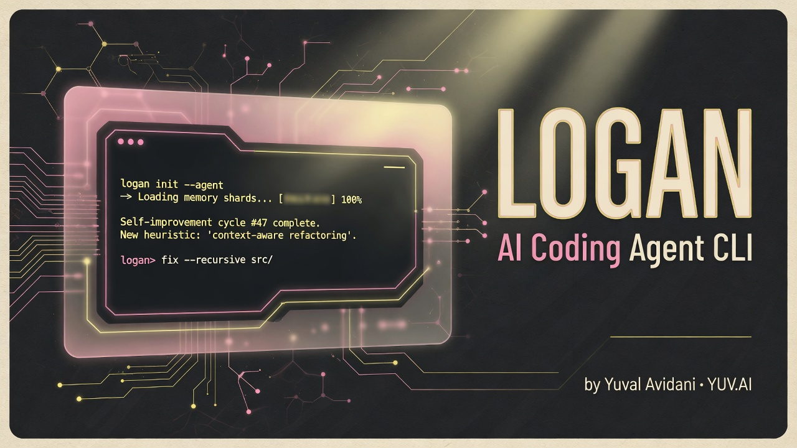
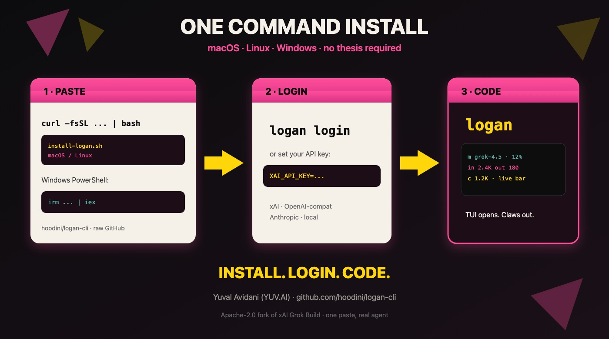
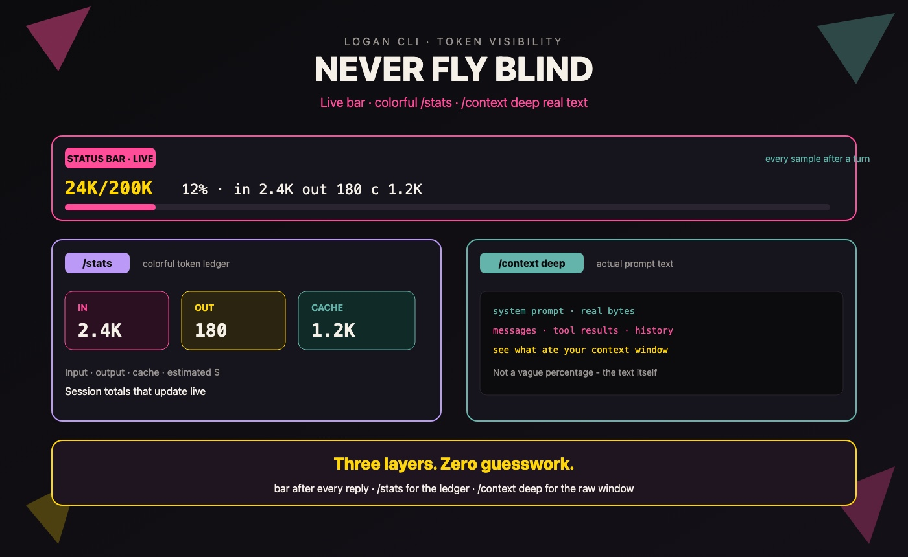
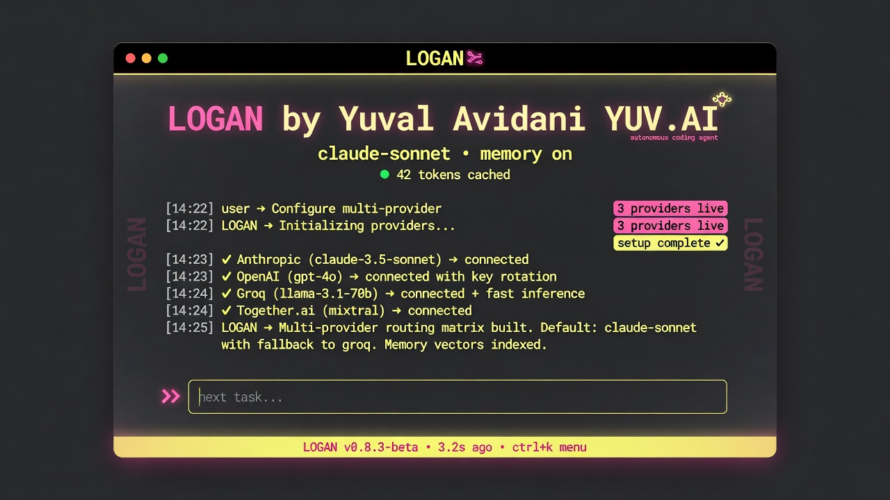
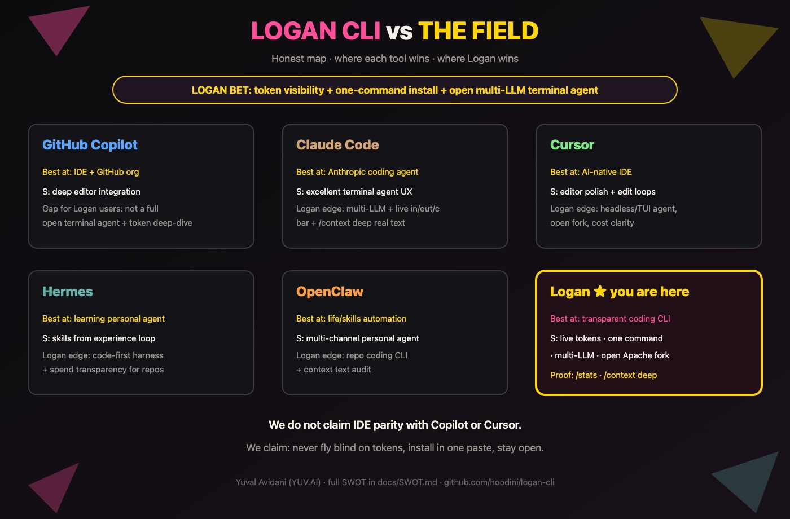
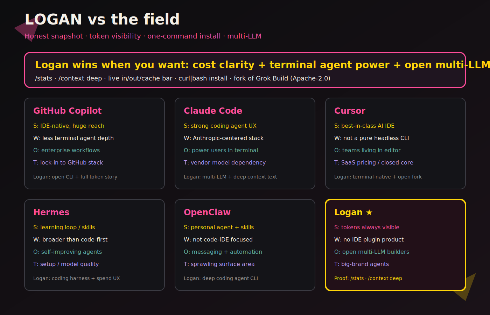
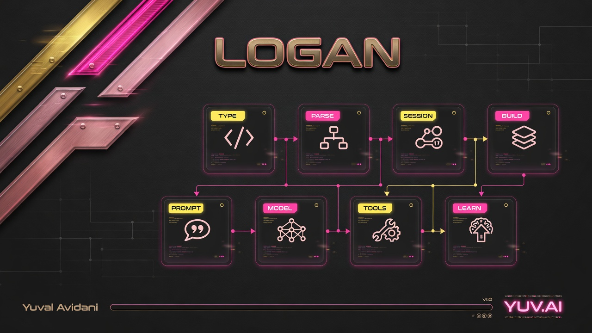

<p align="center">
  
</p>

# Logan

**A coding agent in your terminal.**  
It edits code, runs commands, and **shows every token you spend**.

By [Yuval Avidani (YUV.AI)](https://yuv.ai) · inspired by Wolverine · fork of [xAI Grok Build](https://github.com/xai-org/grok-build) (Apache-2.0)

---

## Install (one command)

### macOS / Linux

```bash
curl -fsSL https://raw.githubusercontent.com/hoodini/logan-cli/main/scripts/install-logan.sh | bash
```

### Windows (PowerShell)

```powershell
irm https://raw.githubusercontent.com/hoodini/logan-cli/main/scripts/install-logan.ps1 | iex
```

That single command gets Logan, puts it on your PATH, sets up `~/.logan`, and starts the app in a normal terminal.

<p align="center">
  
</p>

### Login

```bash
logan login                 # browser - xAI user account (same idea as Grok Build)
logan login --from-grok     # reuse ~/.grok/auth.json if you already use Grok Build
# or: export XAI_API_KEY="your-key"
logan
```

**Which credential wins?** Per-model `api_key`/`env_key` (Claude, OpenAI, Ollama, ...) always wins for that model. Grok session / import is for **default xAI** models. See [docs/SETUP.md](docs/SETUP.md#auth-vs-which-llm-you-use).

---

## First 5 minutes

| You type | What you get |
| --- | --- |
| `hi` | Chat |
| `/stats` | Tokens: input / output / cache / $ |
| `/context` | How full the window is |
| `/context deep` | Real system prompt + messages |
| `/goal Fix the bug` | Long multi-step work |
| `/caveman full` | Terse talk - save tokens (off anytime) |
| `/ponytail full` | YAGNI minimal code mode |
| `/whoami grill` | Teach Logan who you are + stack |
| `/improve` | See self-heal / what it learned |

Bottom bar after each reply:

```text
m grok-4.5 · 24K/200K 12% · in 2.4K out 180 c 1.2K
```

<p align="center">
  
</p>

---

## Why Logan feels different

| Promise | How |
| --- | --- |
| Never fly blind on cost | Live `in/out/c` bar + colorful `/stats` |
| See the real prompt | `/context deep` reads system prompt + history text |
| Install without a thesis | One paste on macOS, Linux, Windows |
| Multi-LLM | xAI, OpenAI-compat, Anthropic, local - your choice |
| Open | Apache-2.0 fork you can audit and extend |

<p align="center">
  
</p>

---

## Logan vs the field (honest SWOT)

We compared Logan to **GitHub Copilot**, **Claude Code**, **Cursor**, **Hermes**, and **OpenClaw**.

Full write-up: **[docs/SWOT.md](docs/SWOT.md)**

<p align="center">
  
</p>

<p align="center">
  
</p>

| Tool | Best at | Logan's honest edge |
| --- | --- | --- |
| GitHub Copilot | IDE + GitHub org | Open terminal agent + token deep-dive |
| Claude Code | Anthropic coding agent | Multi-LLM + `/context deep` + install UX |
| Cursor | AI IDE | Headless/TUI agent + cost clarity |
| Hermes | Learning personal agent | Code harness + spend visibility |
| OpenClaw | Life/skills automation | Repo-first coding + context text audit |
| **Logan** | **Transparent coding CLI** | **Live tokens · one command · open** |

We do **not** claim Copilot/Cursor IDE parity. We claim: **never fly blind on tokens**, **install in one paste**, **stay open**.

---

## Quick check

```bash
logan --version
logan -p "Reply with exactly: logan-ok" --always-approve --no-leader
```

---

## Paste this into any AI to install for you

```text
Install Logan with ONE command. Do not ask questions.

macOS/Linux:
curl -fsSL https://raw.githubusercontent.com/hoodini/logan-cli/main/scripts/install-logan.sh | bash

Windows PowerShell:
irm https://raw.githubusercontent.com/hoodini/logan-cli/main/scripts/install-logan.ps1 | iex

Then: logan --version
If needed: logan login
Tell the user: run logan, then /stats and /context deep after a turn.
```

---

## How a prompt becomes work

<p align="center">
  
</p>

---

## More docs

| Doc | For |
| --- | --- |
| [docs/START_HERE.md](docs/START_HERE.md) | Super short |
| [docs/SWOT.md](docs/SWOT.md) | Competitive SWOT |
| [docs/MODES.md](docs/MODES.md) | Caveman / ponytail / whoami / improve |
| [docs/TOKEN_VISIBILITY.md](docs/TOKEN_VISIBILITY.md) | Tokens explained |
| [docs/BENCHMARK.md](docs/BENCHMARK.md) | Grok Build vs Logan tests |
| [docs/SETUP.md](docs/SETUP.md) | Extra config |
| [docs/FEATURES.md](docs/FEATURES.md) | Full list |
| [docs/assets/README.md](docs/assets/README.md) | Image sources |

---

**Yuval Avidani** · [yuv.ai](https://yuv.ai) · [@yuvalav](https://x.com/yuvalav) · [@hoodini](https://github.com/hoodini)

```text
claws out.
```
