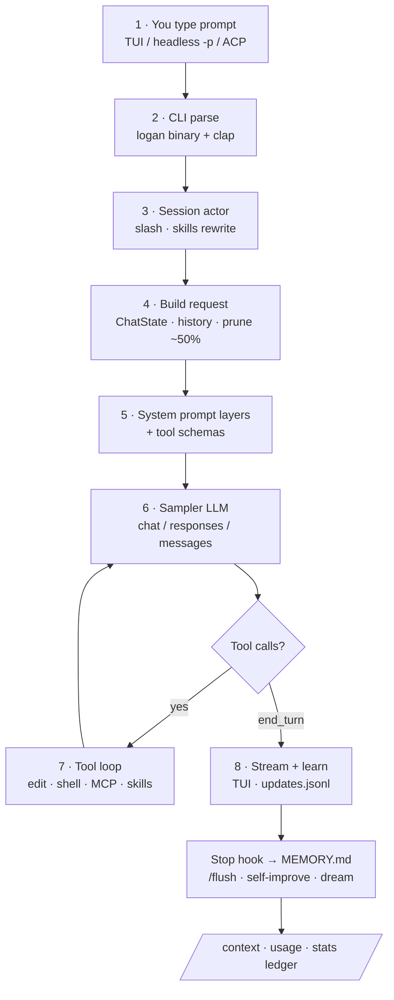
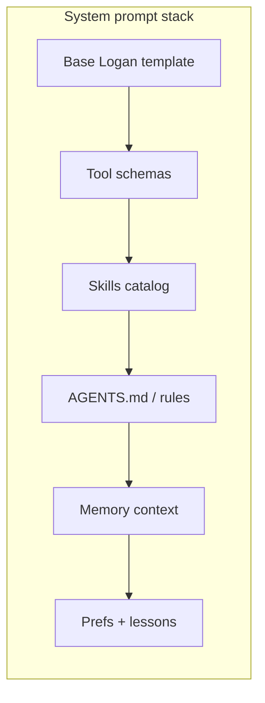
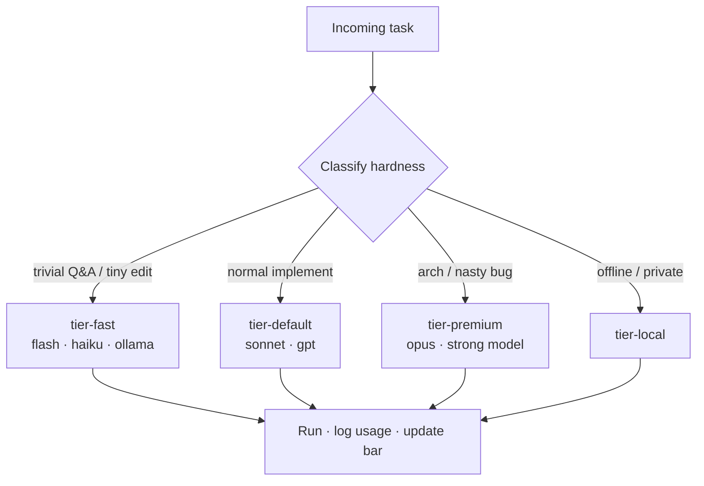
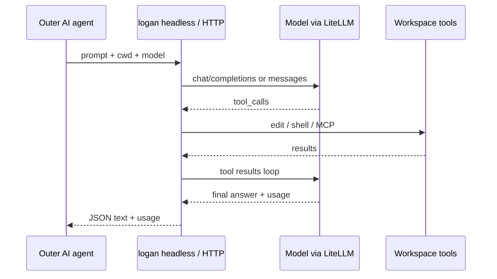

<p align="center">
  
</p>

<pre align="center">
    \\  \\  \\
     \\  \\  \\      L O G A N
      \\  \\  \\     coding agent CLI
       V   V   V     inspired by Wolverine · by Yuval Avidani (YUV.AI)
  ═══════════════════════════════════════
  multi-LLM · memory · self-improve · MCP
  live tokens · /stats · /context deep
</pre>

<h1 align="center">Logan <code>logan</code></h1>

<p align="center">
  <strong>Terminal AI coding agent</strong> by
  <a href="https://yuv.ai"><strong>Yuval Avidani</strong></a> (YUV.AI) - AI Builder &amp; Speaker
  <br/>
  Inspired by <strong>Wolverine</strong> - heal, adapt, claws out for hard bugs.
  <br/>
  Fork of <a href="https://github.com/xai-org/grok-build">xAI Grok Build</a> (Apache-2.0)
</p>

<p align="center">
  <a href="https://github.com/hoodini/logan-cli"></a>
  <a href="docs/SETUP.md"></a>
  <a href="docs/COMPARISON.md"></a>
  <a href="#prompt-journey-how-a-prompt-is-processed"></a>
  <a href="LICENSE"></a>
</p>

```sh
# One-command install - PATH + managed binary + config + skills sync
bash scripts/install-logan.sh
export PATH="$HOME/.local/bin:$PATH"
logan login          # same xAI OIDC as Grok Build
logan                # TUI

# After any turn - see exactly what you are spending:
#   /stats          colorful API in / out / cache / $ by model
#   /context        window composition bar
#   /context deep   actual system prompt + message texts
#   /goal …         autonomous goal loop

logan --version
# Logan by Yuval Avidani (YUV.AI) - v…
```

**Start here:** [docs/START_HERE.md](docs/START_HERE.md) ·
**Token visibility (deep dive):** [docs/TOKEN_VISIBILITY.md](docs/TOKEN_VISIBILITY.md) ·
**LLM install prompt:** [docs/LLM_INSTALL_PROMPT.md](docs/LLM_INSTALL_PROMPT.md)

| | |
| --- | --- |
| Web | [yuv.ai](https://yuv.ai) |
| X | [@yuvalav](https://x.com/yuvalav) |
| GitHub | [@hoodini](https://github.com/hoodini) |
| Instagram | [@yuval_770](https://instagram.com/yuval_770) |
| Linktree | [linktr.ee/yuvai](https://linktr.ee/yuvai) |

---

## Prompt journey (how a prompt is processed)

This is the core of Logan. **Every user message follows this path**
(Mermaid renders natively on GitHub):





| Layer | Content |
| --- | --- |
| 1 | Base template - **Logan** identity, safety, tool rules |
| 2 | API **tool schemas** (often the largest token cost) |
| 3 | **Skills** catalog (budgeted names + descriptions) |
| 4 | Project rules - `AGENTS.md` / `Claude.md` / `.logan/rules` |
| 5 | **Memory** tools + first-turn `<memory-context>` |
| 6 | Role / persona / custom overrides |
| 7 | **Preferences + lessons** from long-term MEMORY.md |

There is **no fixed system-prompt length** - it grows with tools, skills, and rules.
Context: prune tool results ~50% · auto-compact ~85%.

Extra visuals (optional): [journey SVG](docs/assets/infographic-prompt-journey.svg) ·
[journey JPG](docs/assets/infographic-prompt-journey.jpg) ·
[architecture](docs/architecture/ARCHITECTURE.md)

---

## Token visibility first - never fly blind

**Logan’s product promise:** you always know **what you are consuming**, **why the window is full**, and **which text** those tokens are.

Full guide: **[docs/TOKEN_VISIBILITY.md](docs/TOKEN_VISIBILITY.md)**

### Three layers (use in this order)

| Layer | Command / surface | Answers |
| --- | --- | --- |
| **1 · Live** | Status bar (always on) | Window fill `%` · last sample **`in / out / c`** · model · search · mcp |
| **2 · API bill** | **`/stats`** (colorful) | Session **input · output · cache · reasoning · $ · by model** |
| **3 · Real text** | **`/context deep`** | **Actual** system prompt + user/assistant/tool message previews |

```text
# Status bar (no slash needed) - after every sample:
m grok-4.5 · s grok-search · mcp 3    24K / 200K 12% · in 2.4K out 180 c 1.2K
                                      │              └─ last API sample
                                      └─ context window fill (+ ! near compact)

# When you want numbers that stand out:
/stats
  IN  12.4K   OUT  1.8K   CACHE  40.2K   REASON  900
  est. cost  $0.012340
  By model:
    grok-4.5    in …  out …  cache …  calls …

# When you want to read what is in the window:
/context              # composition bar (sys · msg · tools · free)
/context deep         # system_prompt.txt + chat_history.jsonl text, color by role
```

**Color coding (stats + deep dive):**

| Color | Meaning |
| --- | --- |
| Teal | **IN** / system prompt |
| Green | **OUT** / assistant |
| Violet | **CACHE** / tools · reasoning overhead |
| Amber | **REASON** / warnings · compact pressure |
| Brand accent | **$** / user messages |

**Compaction is honest too:**

```text
Compacting context (87% full)…
Compacted 90K → 24K (saved 66K) in 1.2s
```

**Outside the TUI:**

```bash
examples/scripts/dump-prompt-journey.sh     # dump latest system_prompt + sizes
examples/scripts/logan-call.sh "…"          # headless → ~/.logan/stats/usage.jsonl
examples/scripts/usage-rollup.py            # day/model rollup
logan -p "…" --output-format json           # usage in JSON when provider returns it
```

### Feature map (what shipped)

| Need | Status | How |
| --- | --- | --- |
| **Live last-turn chips** | **Shipped** | Status bar `in / out / c` every sample (+ mid-tool window fill) |
| **Colorful `/stats`** | **Shipped** | Bold IN/OUT/CACHE/REASON/$ · by-model ledger |
| **`/context deep`** | **Shipped** | Real system prompt + message texts from session files |
| **Dual-stack chips** | **Shipped** | `m <model> · s <search> · mcp N` |
| **Compact before/after** | **Shipped** | Banner with saved tokens |
| **`/goal`** | **Shipped** | `/goal …` · status · pause/resume/clear (`GROK_GOAL=1` if hidden) |
| **Auto skills + MCP** | **Shipped** | `~/.logan` · `~/.grok` · claude/cursor/agents · `.mcp.json` |
| **One-command install** | **Shipped** | `bash scripts/install-logan.sh` |
| **Smart auto-routing** | **Shipped** | `--route auto` → `tier-fast/default/premium/local` |
| **`/usage` credits** | **Shipped** | Product billing path when applicable |
| **Local stats rollup** | **Scripts** | `logan-call.sh` + `usage-rollup.py` |
| **LiteLLM** | **Works** | OpenAI-compat `base_url` |
| **Langfuse** | **OTEL recipe** | `examples/config/langfuse.env.example` |
| **Remote agent** | **Hardened HTTP** | `examples/scripts/logan-agent-server.py` |
| **Per-skill models** | **Supported** | Skill/agent frontmatter `model:` · [MODEL_ROUTING.md](docs/MODEL_ROUTING.md) |
| **Schedules** | **Supported** | `/loop` · `scheduler_*` · [AUTOMATIONS.md](docs/AUTOMATIONS.md) |

Full map: **[docs/FEATURES.md](docs/FEATURES.md)** · Tokens: **[docs/TOKEN_VISIBILITY.md](docs/TOKEN_VISIBILITY.md)** ·
Remote: **[docs/REMOTE_AGENT.md](docs/REMOTE_AGENT.md)** ·
Walkthrough: **[docs/PROMPT_JOURNEY_WALKTHROUGH.md](docs/PROMPT_JOURNEY_WALKTHROUGH.md)**

### Auto-routing (save tokens)



```bash
cat examples/config/auto-routing.toml >> ~/.logan/config.toml

logan --route auto -p "What does this crate do?"          # → tier-fast
logan --route auto -p "Implement /stats token dashboard"  # → tier-default
logan --route auto -p "Redesign auth architecture"        # → tier-premium
logan --route tier-local -p "Offline review"
```

### Web search + dual stack (Grok + your LLM)

Logan can code with **Claude/OpenAI/Ollama** while still searching via **Grok Build / xAI Responses** (or any Responses-capable search model):

```toml
[models]
default = "claude-sonnet"
web_search = "grok-search"
```

Full explanation: **[docs/WEB_SEARCH.md](docs/WEB_SEARCH.md)**

### Logan as a tool for other agents (remote)

**Not impossible - first-class pattern:**

```bash
# Pattern A: headless
logan -p "Add tests for parser" --output-format json --always-approve -m tier-default

# Pattern B: ACP stdio (IDE / long-lived)
logan agent stdio

# Pattern C: HTTP (localhost)
python3 examples/scripts/logan-agent-server.py --port 8787
curl -s localhost:8787/v1/run -H 'content-type: application/json' -d '{
  "prompt": "List top 3 TODOs",
  "cwd": "/path/to/repo",
  "model": "tier-default"
}'
```



### Goals

```text
/goal Ship /stats token dashboard with cache breakdown
/goal status
/goal pause | resume | clear
```

### LiteLLM + Langfuse

```bash
# models through LiteLLM
cat examples/config/observability.toml >> ~/.logan/config.toml
# OTEL → Langfuse: set OTEL_EXPORTER_OTLP_ENDPOINT + headers (see observability.toml)
```

---

## Grok Build OSS vs Logan

<p align="center">
  
</p>

<p align="center">
  
</p>

| | Grok Build OSS | **Logan** |
| --- | --- | --- |
| Binary | `grok` | **`logan`** |
| Config | `~/.grok` | **`~/.logan`** |
| Identity | xAI / Grok | **YUV.AI · Wolverine-inspired** |
| Token visibility | Basic context | **Live bar + colorful `/stats` + `/context deep` text** |
| Multi-LLM presets | Manual only | **8+ providers ready** |
| Learning loop | No product loop | **skills + auto-reflect hooks** |
| Skills / MCP | Config only | **Auto-load logan + grok + claude/cursor** |
| Install | Manual build | **`scripts/install-logan.sh`** |
| Prompt-journey docs | Fragmented | **README + TOKEN_VISIBILITY + walkthrough** |
| Harness (tools/MCP/sessions) | Yes | **Yes (inherited)** |

Full matrix: **[docs/COMPARISON.md](docs/COMPARISON.md)**

---

## Quick start

```bash
git clone https://github.com/hoodini/logan-cli.git && cd logan-cli
source "$HOME/.cargo/env"   # rustup install if needed
cargo build -p xai-grok-pager-bin --release
cp target/release/logan ~/.local/bin/logan
export PATH="$HOME/.local/bin:$PATH"

mkdir -p ~/.logan
cat examples/config/providers.toml >> ~/.logan/config.toml
# set [models] default = "claude-sonnet" (or openai / ollama / …)
export ANTHROPIC_API_KEY="…"   # or OPENAI_API_KEY / OPENROUTER_API_KEY / …

# memory + learning
# [memory] enabled = true in config
cp examples/config/USER_PREFERENCES.template.md ~/.logan/memory/MEMORY.md
mkdir -p ~/.logan/hooks/bin
cp examples/hooks/auto-reflect.json ~/.logan/hooks/
cp examples/hooks/bin/auto-reflect.py ~/.logan/hooks/bin/
chmod +x ~/.logan/hooks/bin/auto-reflect.py

logan --version
logan -p "Say logan-ok"
```

**Full setup (humans + LLM agents installing Logan):** [docs/SETUP.md](docs/SETUP.md)

---

## Multi-provider LLMs

| Provider | How |
| --- | --- |
| Anthropic | `api_backend = "messages"` |
| OpenAI | `chat_completions` / `responses` |
| Gemini | OpenAI-compat URL |
| OpenRouter | `openrouter.ai/api/v1` |
| Ollama / LM Studio | localhost OpenAI-compat |
| Bedrock | via LiteLLM proxy |

Presets: [examples/config/providers.toml](examples/config/providers.toml)

```bash
logan models
/model claude-sonnet
```

---

## Memory · sessions · self-improve

| Kind | Where |
| --- | --- |
| Short-term | Active conversation + `~/.logan/sessions/<cwd>/<id>/` |
| Long-term | `~/.logan/memory/MEMORY.md` + hybrid index |
| Auto learn | `Stop` / `SessionEnd` hooks → `## Auto reflections` |
| Rich learn | `/flush` · `/skill self-improve` · `/skill learn-user` · autoDream |

---

## MCP connectors (Excalidraw and friends)

Logan uses the same MCP stack as Grok Build.

**Preferred (what we use):** connect MCP servers via the **Grok Build website connectors** UI - including **Excalidraw**. Once connected there, they show up for the agent session like other product connectors.

Optional local/stdio example (Node `npx`) remains for offline/dev:

```toml
# examples/config/mcp-excalidraw.toml  (optional fallback)
[mcp_servers.excalidraw]
command = "npx"
args = ["-y", "excalidraw-mcp"]
```

Repo diagrams are also plain files you can open on [excalidraw.com](https://excalidraw.com):

- [01-prompt-lifecycle.excalidraw](docs/architecture/01-prompt-lifecycle.excalidraw)
- [02-memory-sessions-context.excalidraw](docs/architecture/02-memory-sessions-context.excalidraw)
- [03-system-prompt-composition.excalidraw](docs/architecture/03-system-prompt-composition.excalidraw)
- [04-providers-self-improve.excalidraw](docs/architecture/04-providers-self-improve.excalidraw)

---

## Docs & assets

| Doc | Contents |
| --- | --- |
| [docs/FEATURES.md](docs/FEATURES.md) | Goals, tokens, auto-route, LiteLLM/Langfuse, remote agent |
| [docs/PROMPT_JOURNEY_WALKTHROUGH.md](docs/PROMPT_JOURNEY_WALKTHROUGH.md) | **Real example**: system prompt + context window + tokens |
| [docs/WEB_SEARCH.md](docs/WEB_SEARCH.md) | How online search works · dual-stack Grok + Claude |
| [docs/UX_VISION.md](docs/UX_VISION.md) | Live tokens, compact warnings, learn notifications |
| [docs/MODEL_ROUTING.md](docs/MODEL_ROUTING.md) | Models per skill / subagent / role |
| [docs/AUTOMATIONS.md](docs/AUTOMATIONS.md) | `/loop`, scheduler, cron, launchd, Windows |
| [docs/REMOTE_AGENT.md](docs/REMOTE_AGENT.md) | Call Logan from other AIs / HTTP |
| [docs/SETUP.md](docs/SETUP.md) | Install + LLM setup |
| [docs/COMPARISON.md](docs/COMPARISON.md) | vs Grok Build OSS |
| [docs/architecture/ARCHITECTURE.md](docs/architecture/ARCHITECTURE.md) | Deep architecture |

| Asset | Path |
| --- | --- |
| Hero banner | [docs/assets/banner.jpg](docs/assets/banner.jpg) |
| Prompt journey (Mermaid) | this README |
| Prompt journey (svg/jpg) | [docs/assets/](docs/assets/) |
| Project overview | [docs/assets/infographic-project-overview.svg](docs/assets/infographic-project-overview.svg) |
| vs Grok Build | [docs/assets/infographic-vs-grok-build.svg](docs/assets/infographic-vs-grok-build.svg) |
| ASCII banner | [docs/assets/ascii-banner.txt](docs/assets/ascii-banner.txt) |

Diagrams: **Mermaid first** (GitHub-native). SVG/JPG as extras. Excalidraw files optional offline.

---

## License

Logan product work by **Yuval Avidani (YUV.AI)**.  
“Inspired by Wolverine” is a fan tribute aesthetic - not affiliated with Marvel.  
Upstream Grok Build remains Apache-2.0 - [LICENSE](LICENSE) · [NOTICE](NOTICE) · [AUTHORS](AUTHORS.md).
