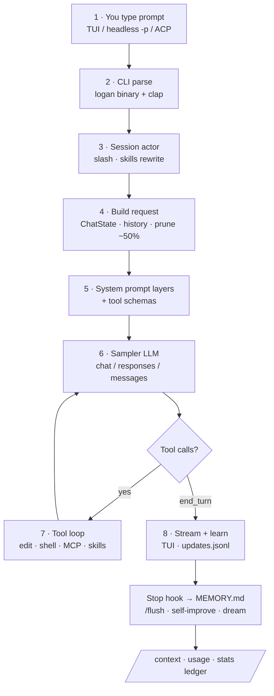
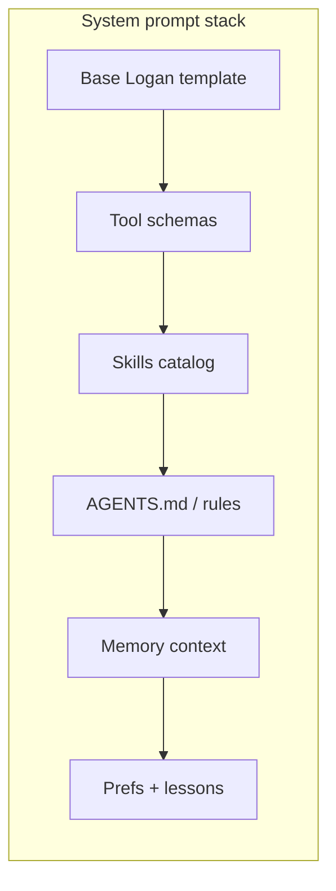
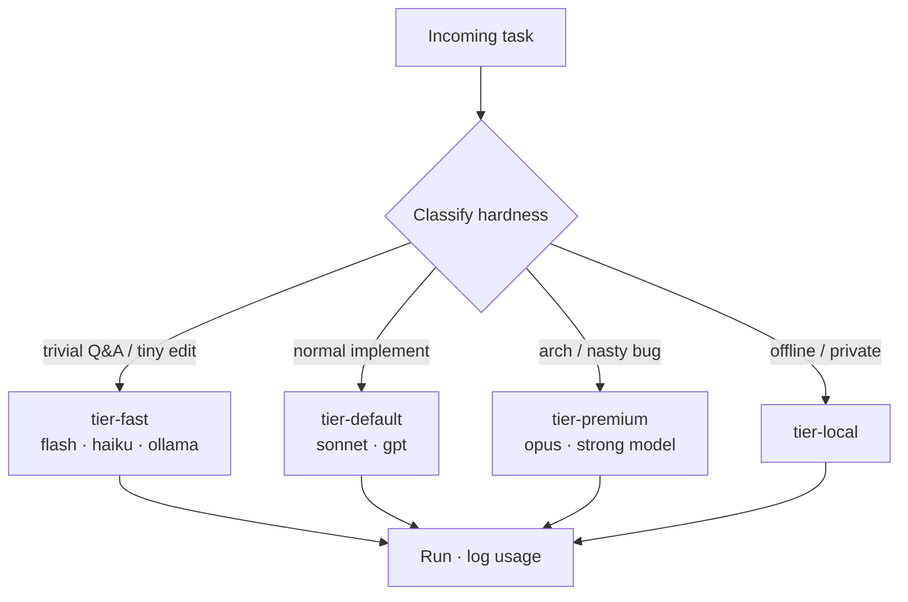
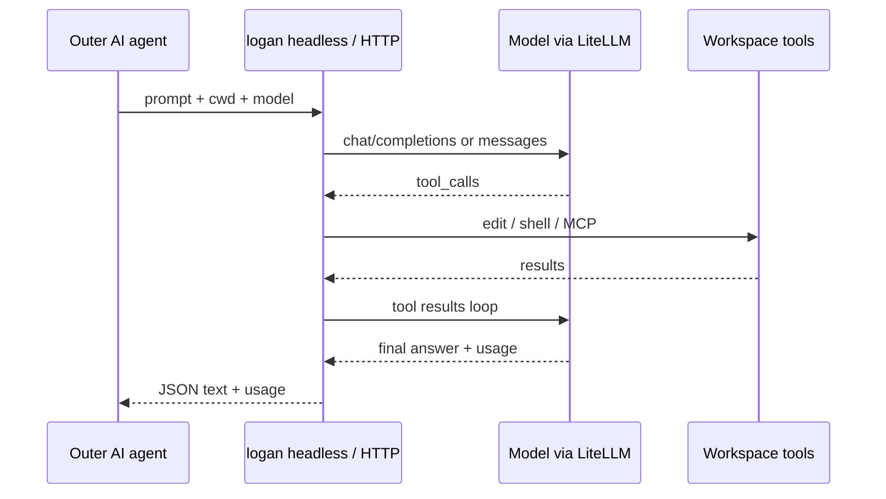

<p align="center">
  
</p>

<pre align="center">
    \\  \\  \\
     \\  \\  \\      L O G A N
      \\  \\  \\     coding agent CLI
       V   V   V     inspired by Wolverine · by Yuval Avidani (YUV.AI)
  ═══════════════════════════════════════
  multi-LLM · memory · self-improve · MCP
</pre>

<h1 align="center">Logan <code>logan</code></h1>

<p align="center">
  <strong>Terminal AI coding agent</strong> by
  <a href="https://yuv.ai"><strong>Yuval Avidani</strong></a> (YUV.AI) - AI Builder &amp; Speaker
  <br/>
  Inspired by <strong>Wolverine</strong> - heal, adapt, claws out for hard bugs.
  <br/>
  Fork of <a href="https://github.com/xai-org/grok-build">xAI Grok Build</a> (Apache-2.0)
</p>

<p align="center">
  <a href="https://github.com/hoodini/logan-cli"></a>
  <a href="docs/SETUP.md"></a>
  <a href="docs/COMPARISON.md"></a>
  <a href="#prompt-journey-how-a-prompt-is-processed"></a>
  <a href="LICENSE"></a>
</p>

```sh
logan --version
# Logan TUI by Yuval Avidani (YUV.AI) - https://yuv.ai
```

| | |
| --- | --- |
| Web | [yuv.ai](https://yuv.ai) |
| X | [@yuvalav](https://x.com/yuvalav) |
| GitHub | [@hoodini](https://github.com/hoodini) |
| Instagram | [@yuval_770](https://instagram.com/yuval_770) |
| Linktree | [linktr.ee/yuvai](https://linktr.ee/yuvai) |

---

## Prompt journey (how a prompt is processed)

This is the core of Logan. **Every user message follows this path**
(Mermaid renders natively on GitHub):





| Layer | Content |
| --- | --- |
| 1 | Base template - **Logan** identity, safety, tool rules |
| 2 | API **tool schemas** (often the largest token cost) |
| 3 | **Skills** catalog (budgeted names + descriptions) |
| 4 | Project rules - `AGENTS.md` / `Claude.md` / `.logan/rules` |
| 5 | **Memory** tools + first-turn `<memory-context>` |
| 6 | Role / persona / custom overrides |
| 7 | **Preferences + lessons** from long-term MEMORY.md |

There is **no fixed system-prompt length** - it grows with tools, skills, and rules.
Context: prune tool results ~50% · auto-compact ~85%.

Extra visuals (optional): [journey SVG](docs/assets/infographic-prompt-journey.svg) ·
[journey JPG](docs/assets/infographic-prompt-journey.jpg) ·
[architecture](docs/architecture/ARCHITECTURE.md)

---

## Tokens, stats, auto-routing, goals, remote agent

**Devs need visibility and control.** Here is what exists vs what Logan is productizing:

| Need | Status | How |
| --- | --- | --- |
| **`/goal`** (Claude Code-class) | **Already here** | `/goal …` · `/goal status` · pause/resume/clear · enable with `GROK_GOAL=1` if hidden |
| **Token / context breakdown** | **Already here** | `/context` · `/session-info` · headless JSON `usage` · OTEL `input/output/cache_read` |
| **`/usage`** | **Already here** | Credits/billing path |
| **Local stats rollup** | **Logan scripts** | `examples/scripts/logan-call.sh` → `~/.logan/stats/usage.jsonl` · `usage-rollup.py` |
| **Smart auto-routing** | **Tiers + skill now** | `examples/config/auto-routing.toml` · `/skill auto-route` · native `--route auto` planned |
| **LiteLLM** | **Works today** | OpenAI-compat `base_url` → LiteLLM proxy |
| **Langfuse** | **OTEL path** | `examples/config/observability.toml` → OTLP to Langfuse |
| **Remote agent for other AIs** | **Works today** | Headless `-p` · `agent stdio` · HTTP wrapper |

Full map: **[docs/FEATURES.md](docs/FEATURES.md)** · Remote: **[docs/REMOTE_AGENT.md](docs/REMOTE_AGENT.md)**

### Auto-routing (save tokens)



```bash
# configure tiers
cat examples/config/auto-routing.toml >> ~/.logan/config.toml
logan -m tier-fast -p "What does this crate do?"
logan -m tier-premium -p "Redesign auth for multi-tenant"
# mid-session: /skill auto-route
```

### Token visibility

```bash
# In TUI
/context          # system / messages / tools / free
/session-info     # session rollup
/usage            # credits when applicable

# As another agent (JSON + ledger)
examples/scripts/logan-call.sh "Run tests and fix failures"
python3 examples/scripts/usage-rollup.py --by-model
```

### Logan as a tool for other agents (remote)

**Not impossible - first-class pattern:**

```bash
# Pattern A: headless
logan -p "Add tests for parser" --output-format json --always-approve -m tier-default

# Pattern B: ACP stdio (IDE / long-lived)
logan agent stdio

# Pattern C: HTTP (localhost)
python3 examples/scripts/logan-agent-server.py --port 8787
curl -s localhost:8787/v1/run -H 'content-type: application/json' -d '{
  "prompt": "List top 3 TODOs",
  "cwd": "/path/to/repo",
  "model": "tier-default"
}'
```



### Goals

```text
/goal Ship /stats token dashboard with cache breakdown
/goal status
/goal pause | resume | clear
```

### LiteLLM + Langfuse

```bash
# models through LiteLLM
cat examples/config/observability.toml >> ~/.logan/config.toml
# OTEL → Langfuse: set OTEL_EXPORTER_OTLP_ENDPOINT + headers (see observability.toml)
```

---

## Grok Build OSS vs Logan

<p align="center">
  
</p>

<p align="center">
  
</p>

| | Grok Build OSS | **Logan** |
| --- | --- | --- |
| Binary | `grok` | **`logan`** |
| Config | `~/.grok` | **`~/.logan`** |
| Identity | xAI / Grok | **YUV.AI · Wolverine-inspired** |
| Multi-LLM presets | Manual only | **8+ providers ready** |
| Learning loop | No product loop | **skills + auto-reflect hooks** |
| Prompt-journey docs | Fragmented | **README + infographics + Excalidraw** |
| Harness (tools/MCP/sessions) | Yes | **Yes (inherited)** |

Full matrix: **[docs/COMPARISON.md](docs/COMPARISON.md)**

---

## Quick start

```bash
git clone https://github.com/hoodini/logan-cli.git && cd logan-cli
source "$HOME/.cargo/env"   # rustup install if needed
cargo build -p xai-grok-pager-bin --release
cp target/release/logan ~/.local/bin/logan
export PATH="$HOME/.local/bin:$PATH"

mkdir -p ~/.logan
cat examples/config/providers.toml >> ~/.logan/config.toml
# set [models] default = "claude-sonnet" (or openai / ollama / …)
export ANTHROPIC_API_KEY="…"   # or OPENAI_API_KEY / OPENROUTER_API_KEY / …

# memory + learning
# [memory] enabled = true in config
cp examples/config/USER_PREFERENCES.template.md ~/.logan/memory/MEMORY.md
mkdir -p ~/.logan/hooks/bin
cp examples/hooks/auto-reflect.json ~/.logan/hooks/
cp examples/hooks/bin/auto-reflect.py ~/.logan/hooks/bin/
chmod +x ~/.logan/hooks/bin/auto-reflect.py

logan --version
logan -p "Say logan-ok"
```

**Full setup (humans + LLM agents installing Logan):** [docs/SETUP.md](docs/SETUP.md)

---

## Multi-provider LLMs

| Provider | How |
| --- | --- |
| Anthropic | `api_backend = "messages"` |
| OpenAI | `chat_completions` / `responses` |
| Gemini | OpenAI-compat URL |
| OpenRouter | `openrouter.ai/api/v1` |
| Ollama / LM Studio | localhost OpenAI-compat |
| Bedrock | via LiteLLM proxy |

Presets: [examples/config/providers.toml](examples/config/providers.toml)

```bash
logan models
/model claude-sonnet
```

---

## Memory · sessions · self-improve

| Kind | Where |
| --- | --- |
| Short-term | Active conversation + `~/.logan/sessions/<cwd>/<id>/` |
| Long-term | `~/.logan/memory/MEMORY.md` + hybrid index |
| Auto learn | `Stop` / `SessionEnd` hooks → `## Auto reflections` |
| Rich learn | `/flush` · `/skill self-improve` · `/skill learn-user` · autoDream |

---

## MCP connectors (Excalidraw and friends)

Logan uses the same MCP stack as Grok Build.

**Preferred (what we use):** connect MCP servers via the **Grok Build website connectors** UI - including **Excalidraw**. Once connected there, they show up for the agent session like other product connectors.

Optional local/stdio example (Node `npx`) remains for offline/dev:

```toml
# examples/config/mcp-excalidraw.toml  (optional fallback)
[mcp_servers.excalidraw]
command = "npx"
args = ["-y", "excalidraw-mcp"]
```

Repo diagrams are also plain files you can open on [excalidraw.com](https://excalidraw.com):

- [01-prompt-lifecycle.excalidraw](docs/architecture/01-prompt-lifecycle.excalidraw)
- [02-memory-sessions-context.excalidraw](docs/architecture/02-memory-sessions-context.excalidraw)
- [03-system-prompt-composition.excalidraw](docs/architecture/03-system-prompt-composition.excalidraw)
- [04-providers-self-improve.excalidraw](docs/architecture/04-providers-self-improve.excalidraw)

---

## Assets

| Asset | Path |
| --- | --- |
| Hero banner | [docs/assets/banner.jpg](docs/assets/banner.jpg) |
| Prompt journey (jpg) | [docs/assets/infographic-prompt-journey.jpg](docs/assets/infographic-prompt-journey.jpg) |
| Prompt journey (svg) | [docs/assets/infographic-prompt-journey.svg](docs/assets/infographic-prompt-journey.svg) |
| Project overview | [docs/assets/infographic-project-overview.svg](docs/assets/infographic-project-overview.svg) |
| vs Grok Build | [docs/assets/infographic-vs-grok-build.svg](docs/assets/infographic-vs-grok-build.svg) |
| ASCII banner | [docs/assets/ascii-banner.txt](docs/assets/ascii-banner.txt) |
| TUI welcome logo | `crates/codegen/xai-grok-pager/assets/logo/logo07.txt` |

---

## License

Logan product work by **Yuval Avidani (YUV.AI)**.  
“Inspired by Wolverine” is a fan tribute aesthetic - not affiliated with Marvel.  
Upstream Grok Build remains Apache-2.0 - [LICENSE](LICENSE) · [NOTICE](NOTICE) · [AUTHORS](AUTHORS.md).
