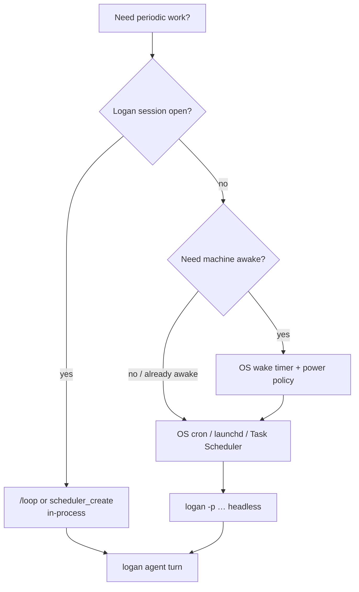

# Automations, schedules, and keeping the machine ready

Logan can run **recurring agent work** inside a session, and you can combine
that with **OS-level schedulers** so jobs fire even when no TUI is open.

Author: Yuval Avidani (YUV.AI) · https://yuv.ai

---

## Layers (pick the right one)



| Layer | Survives quit? | Wakes computer? | Best for |
| --- | --- | --- | --- |
| `/loop` + `scheduler_*` tools | Optional `durable` | **No** | CI watch, test every N min while working |
| `monitor` tool | No (session) | No | Log tails, event streams |
| **macOS launchd** | Yes | With power settings / `pmset` | Daily PR triage, morning brief |
| **Linux cron / systemd timers** | Yes | With RTC wake if configured | Servers, always-on boxes |
| **Windows Task Scheduler** | Yes | Wake timers in task settings | Dev laptops / build boxes |
| External CI (GitHub Actions) | Yes | N/A (cloud) | Repo automation without your PC |

Logan does **not** replace OS power management. “Make sure computer is up”
is an OS concern; Logan is the agent you run *after* the box is awake.

---

## 1. In-Logan scheduler (already built)

Docs: user-guide `20-background-tasks.md`.

### `/loop` (human-friendly)

```text
/loop 5m Run the test suite and report only new failures
/loop 2m Check GitHub Actions for this PR; stop when green or red
```

### Tools

| Tool | Purpose |
| --- | --- |
| `scheduler_create` | interval `5m`/`2h`/`1d`/`60s`, prompt, recurring, durable, fire_immediately |
| `scheduler_list` | show jobs |
| `scheduler_delete` | cancel by id |

```text
Create a durable daily job: every 1d, prompt =
"Summarize open PRs I author and draft a standup note in memory"
```

Notes:

- Min interval 60s; recurring jobs auto-expire after **7 days** unless recreated
- `durable: true` aims to persist across sessions (verify in your build)
- Still requires Logan/agent runtime available when the timer fires

### Background + monitors

- Long builds: shell tool with `background: true`
- Live logs: `monitor` + line-buffered grep
- Tasks pane: `Ctrl+B`

---

## 2. OS-level: call Logan headless on a schedule

This is how you get **real automations** (cron-class):

```bash
# Shared pattern
export PATH="$HOME/.local/bin:$HOME/.cargo/bin:$PATH"
export ANTHROPIC_API_KEY=…   # or use LiteLLM
logan -p "Your automation prompt" \
  --cwd "$HOME/logan-cli" \
  -m tier-fast \
  --output-format json \
  --always-approve \
  --max-turns 25 \
  >> "$HOME/.logan/logs/automation.log" 2>&1
```

Or use the wrapper (writes usage ledger):

```bash
CWD=$HOME/logan-cli MODEL=tier-fast \
  examples/scripts/logan-call.sh "Check for outdated deps and open an issue if critical"
```

### macOS - launchd

`~/Library/LaunchAgents/ai.yuv.logan.standup.plist`:

```xml
<?xml version="1.0" encoding="UTF-8"?>
<!DOCTYPE plist PUBLIC "-//Apple//DTD PLIST 1.0//EN" "http://www.apple.com/DTDs/PropertyList-1.0.dtd">
<plist version="1.0">
<dict>
  <key>Label</key><string>ai.yuv.logan.standup</string>
  <key>ProgramArguments</key>
  <array>
    <string>/bin/zsh</string>
    <string>-lc</string>
    <string>source ~/.zshrc; logan -p "Draft my standup from recent commits" --cwd $HOME/logan-cli -m tier-fast --always-approve --output-format plain</string>
  </array>
  <key>StartCalendarInterval</key>
  <dict>
    <key>Hour</key><integer>9</integer>
    <key>Minute</key><integer>0</integer>
  </dict>
  <key>StandardOutPath</key><string>/tmp/logan-standup.log</string>
  <key>StandardErrorPath</key><string>/tmp/logan-standup.err</string>
</dict>
</plist>
```

```bash
launchctl load ~/Library/LaunchAgents/ai.yuv.logan.standup.plist
```

**Wake:** System Settings → Battery → Options → wake for network access; or
`pmset` schedule (admin). Logan cannot wake a fully sleeping Mac by itself.

Optional keep-awake during a long agent run:

```bash
caffeinate -i logan -p "Long job…" --always-approve
```

### Linux - cron

```cron
# m h dom mon dow command
0 9 * * 1-5  /usr/bin/env bash -lc 'logan -p "Morning CI summary" --cwd $HOME/proj -m tier-fast --always-approve' >>$HOME/.logan/logs/cron.log 2>&1
```

Or systemd user timer for better logging and `Persistent=true` after downtime.

**Wake:** RTC wake via `rtcwake` / firmware - separate from Logan.

### Windows - Task Scheduler

1. Create Basic Task → Daily  
2. Action: Start a program  
   - Program: `logan.exe` (or `wsl.exe`)  
   - Arguments: `-p "…" --cwd C:\work\repo -m tier-fast --always-approve`  
3. Conditions → **Wake the computer to run this task**  
4. Run whether user is logged on or not (store credentials carefully)

PowerShell example:

```powershell
logan -p "Sync and report git status" --cwd C:\work\repo -m tier-fast --always-approve
```

---

## 3. “Ensure computer is up” patterns

| Goal | Approach |
| --- | --- |
| Laptop lid closed | OS wake timers + AC power; not reliable on all laptops |
| Always-on mini PC / server | Best host for durable Logan automations |
| Cloud | Run `logan` in CI or a small VM; no local wake needed |
| Remote agent | Keep `logan-agent-server.py` under systemd/launchd with restart |

Health check automation:

```bash
# every 10m via cron - if agent server down, restart
curl -sf localhost:8787/health || systemctl --user restart logan-agent
```

---

## 4. Safety for unattended runs

1. Prefer `--tools` allowlists for read-only jobs  
2. Use `--deny "Bash(rm*)"` style rules  
3. Cap `--max-turns` and wall time  
4. Log to `~/.logan/logs/` and rotate  
5. Never put API keys in world-readable scripts - use env / secret store  
6. For PR-opening jobs, require a dedicated bot account  

---

## 5. Examples worth copying

| Automation | Interval | Model tier |
| --- | --- | --- |
| Test regressions while coding | `/loop 5m` | default |
| PR CI watch | `/loop 2m` | fast |
| Morning standup draft | launchd 09:00 | fast |
| Weekly dependency audit | cron weekly | default |
| Self-improve memory flush | daily durable | default |

---

## Related

- User guide: background tasks / scheduler  
- [REMOTE_AGENT.md](REMOTE_AGENT.md)  
- [MODEL_ROUTING.md](MODEL_ROUTING.md)  
- `examples/scripts/logan-call.sh`
