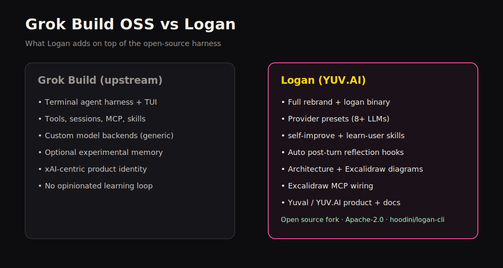

# Grok Build (open source) vs Logan

**Logan** is a productized fork of [xAI Grok Build](https://github.com/xai-org/grok-build)
by **Yuval Avidani (YUV.AI)**. Upstream gives you a powerful coding-agent
harness. Logan keeps that core and adds identity, multi-LLM presets,
learning loops, architecture docs, and ship-ready setup.

| Area | Grok Build OSS | Logan |
| --- | --- | --- |
| Product binary | `grok` / `xai-grok-pager` | **`logan`** |
| Brand / author | SpaceXAI / xAI | **Yuval Avidani · YUV.AI** ([yuv.ai](https://yuv.ai)) |
| Config home | `~/.grok` | **`~/.logan`** (`LOGAN_HOME`) |
| Default system label | Grok | **Logan** |
| Multi-provider presets | Manual `[model.*]` only | **Ready TOML for 8+ providers** |
| Anthropic / OpenAI / Gemini / OpenRouter | Possible via generic backends | **Documented + copy-paste presets** |
| Ollama / LM Studio / LiteLLM / Bedrock | Possible / proxy | **Documented presets** (Bedrock via LiteLLM) |
| Self-improve skill | No | **`self-improve` skill** |
| Learn-user skill | No | **`learn-user` skill** (personal prefs) |
| Auto post-turn reflection | No first-class loop | **`Stop` / `SessionEnd` hooks** → MEMORY.md |
| Memory UX packaging | Experimental, opt-in | **Guided setup + preference template** |
| Architecture docs | User guide fragments | **Full ARCHITECTURE + Excalidraw diagrams** |
| Excalidraw / MCP connectors | Website connectors + local MCP | **Same website connectors (preferred)** + optional local fallback |
| Wolverine-inspired brand | No | **Claw banner, ASCII, welcome tagline** |
| Prompt-journey on README | No first-class journey | **Infographics + 8-step path on README** |
| **Token / usage visibility** | Basic `/context` | **Live bar + colorful `/stats` + `/context deep` real text** · [TOKEN_VISIBILITY.md](TOKEN_VISIBILITY.md) |
| One-command install | Manual | **`scripts/install-logan.sh`** |
| Auto skills/MCP from other agents | Partial | **`~/.logan` + `~/.grok` + claude/cursor/agents** |
| Repo banner / screenshots | Upstream branding | **Logan hero assets** |
| Comparison + LLM setup guide | - | **This doc + [SETUP.md](SETUP.md)** |
| Attribution | xAI | Logan + Apache NOTICE for upstream |

## What Grok Build already gives both projects

Logan **inherits** (does not replace) the upstream harness:

- Full-screen TUI, headless, ACP
- Agent loop, tools, sandbox, permissions
- Sessions (`updates.jsonl`, resume/continue)
- Skills, plugins, MCP, hooks engines
- Compaction + token management
- Experimental cross-session memory + autoDream
- Three wire protocols: `chat_completions`, `responses`, `messages`

## What only Logan emphasizes / ships

### 1. Multi-LLM product path

Upstream can hit custom endpoints. Logan ships
[examples/config/providers.toml](../examples/config/providers.toml) so you can
be productive on Anthropic, OpenAI, Gemini, OpenRouter, Ollama, LM Studio,
LiteLLM, and Bedrock-via-proxy in minutes.

### 2. Hermes-style learning

| Piece | Logan |
| --- | --- |
| Skill `self-improve` | Distill what worked / failed into lessons |
| Skill `learn-user` | Build a living preference profile |
| Hooks `Stop` + `SessionEnd` | Append reflection stubs to long-term memory |
| Preference template | Seed `~/.logan/memory/MEMORY.md` |

### 3. Token visibility product surface

Logan ships a clear **three-layer** story so you never guess spend:

1. **Live status bar** - fill % + last sample `in / out / c` + model/search/mcp chips  
2. **`/stats`** - colorful API ledger (IN/OUT/CACHE/REASON/$) by model  
3. **`/context deep`** - actual system prompt + message texts for those tokens  

Guide: [TOKEN_VISIBILITY.md](TOKEN_VISIBILITY.md)

### 4. Operator docs

- [ARCHITECTURE.md](architecture/ARCHITECTURE.md) - prompt lifecycle, memory, system prompt layers
- Excalidraw diagrams in `docs/architecture/*.excalidraw`
- [SETUP.md](SETUP.md) - human + LLM-agent install playbook
- [TOKEN_VISIBILITY.md](TOKEN_VISIBILITY.md) - usage / tokens / deep dive

### 5. Identity

Binary, help text, welcome banner, AUTHORS/NOTICE, and GitHub presence are
Logan / YUV.AI - while still honoring Apache-2.0 upstream attribution.

## Honest limits (shared or still TODO)

| Limit | Notes |
| --- | --- |
| Native AWS Bedrock SigV4 | Not in harness - use LiteLLM |
| Crate names | Still `xai-grok-*` internally |
| Default xAI auth CDN | Still present until fully rewired |
| Automatic outcome scoring | Hooks + skills first; smarter scoring planned |

## Bottom line

| If you want… | Use |
| --- | --- |
| Upstream source transparency / monorepo sync | Grok Build OSS |
| A named CLI product with multi-LLM presets, learning, and docs | **Logan** |

Repo: https://github.com/hoodini/logan-cli  
Author: Yuval Avidani · https://yuv.ai
