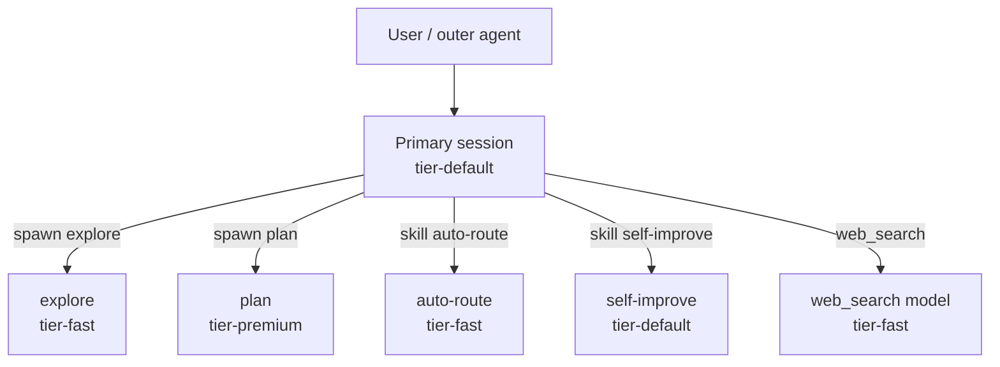

# Assign models to skills, subagents, and roles

Logan (via the Grok Build harness) already supports **per-role and per-agent
models**. Skills can declare a preferred model in frontmatter. This doc is the
practical cookbook for token-saving routing.

Author: Yuval Avidani (YUV.AI) · https://yuv.ai

---

## Quick matrix

| Surface | Can pin a model? | How |
| --- | --- | --- |
| Main session | Yes | `-m` / `/model` / `[models].default` |
| **Subagents** | **Yes** | Agent markdown frontmatter `model:` or Task tool model param |
| **Skills** | **Yes** | Skill frontmatter `model:` + `effort:` |
| Goal planner / strategist | Yes | Config / remote `goal_*_model` |
| Web search | Yes | `[models] web_search = "…"` |
| Session summary / flush | Yes | `[models] session_summary` / `[compaction.memory_flush] flush_model` |
| Image description | Yes | `[models] image_description` |
| Fork secondary | Yes | UI/config fork secondary model |
| Auto tier router | Partial | Tiers + `/skill auto-route` now; native `--route auto` planned |

---

## 1. Subagents with their own LLM

Agent definitions (markdown frontmatter) support:

```yaml
---
name: explore-cheap
description: Fast read-only exploration
model: tier-fast          # or inherit | specific model id
# model: inherit          # default - use parent session model
---

You explore codebases quickly. Prefer grep and read_file. No edits.
```

```yaml
---
name: implementer
description: Heavy implementation subagent
model: tier-premium
---

You implement multi-file changes carefully and run tests.
```

### Built-in types

When spawning via tools (`spawn_subagent` / Task):

- `explore` - read-only, good candidate for **fast** model
- `plan` - architecture, good candidate for **premium**
- `general-purpose` - inherit or default tier

Parent can constrain allowed models for subagent tasks (tool description lists
allowed slugs). Prefer documenting allowed tiers in your team AGENTS.md.

### Config-style idea (Logan product)

```toml
# examples/config/model-assignments.toml
[models]
default = "tier-default"
web_search = "tier-fast"
session_summary = "tier-fast"

# Conceptual map (use with agent files + skill frontmatter):
# explore subagent  -> tier-fast
# plan subagent     -> tier-premium
# self-improve skill -> tier-default
```

---

## 2. Skills with their own LLM

Skill frontmatter (already parsed by the harness):

```markdown
---
name: self-improve
description: Reflect on what worked / failed
model: tier-default
effort: medium
---

# Self-improve
…
```

```markdown
---
name: auto-route
description: Pick a cheap tier for this task
model: tier-fast
effort: low
---
```

When the skill runs, the session can switch or spawn work under that model
depending on skill runtime wiring - always verify with `/session-info` after
invoking a skill that declares `model:`.

**Logan tip:** put expensive skills (deep review) on premium; classification
and routing skills on fast.

---

## 3. Special pipelines (config)

```toml
[models]
default = "tier-default"
web_search = "tier-fast"
session_summary = "tier-fast"
image_description = "tier-fast"

[compaction.memory_flush]
enabled = true
flush_model = "tier-fast"   # if supported in your build
```

Goal roles (when goal mode is on) can take separate planner/strategist models
via remote/local goal model settings (`goal_planner_model`,
`goal_strategist_model`).

---

## 4. Recommended “team of models” setup

```text
tier-fast      → explore subagent, auto-route skill, web_search, summaries
tier-default   → primary chat, implementer, self-improve
tier-premium   → plan subagent, hard debug, security reviews
tier-local     → offline / private bulk work
tier-gateway   → everything via LiteLLM when org requires it
```

Ship tiers: [examples/config/auto-routing.toml](../examples/config/auto-routing.toml)  
Assignments example: [examples/config/model-assignments.toml](../examples/config/model-assignments.toml)



---

## 5. What is *not* automatic yet

| Wish | Status |
| --- | --- |
| Global `[skills.self-improve].model` TOML map | Use skill frontmatter today |
| Force every explore spawn to tier-fast without agent files | Document + agent defs; harness may still inherit unless model set |
| One UI picker “models per role” | Product UX planned |

---

## Related

- [FEATURES.md](FEATURES.md)
- [PROMPT_JOURNEY_WALKTHROUGH.md](PROMPT_JOURNEY_WALKTHROUGH.md)
- Skill frontmatter tests in `xai-grok-agent` (`model:`, `effort:`)
- Agent frontmatter `ModelOverride::{Inherit, Override}`
