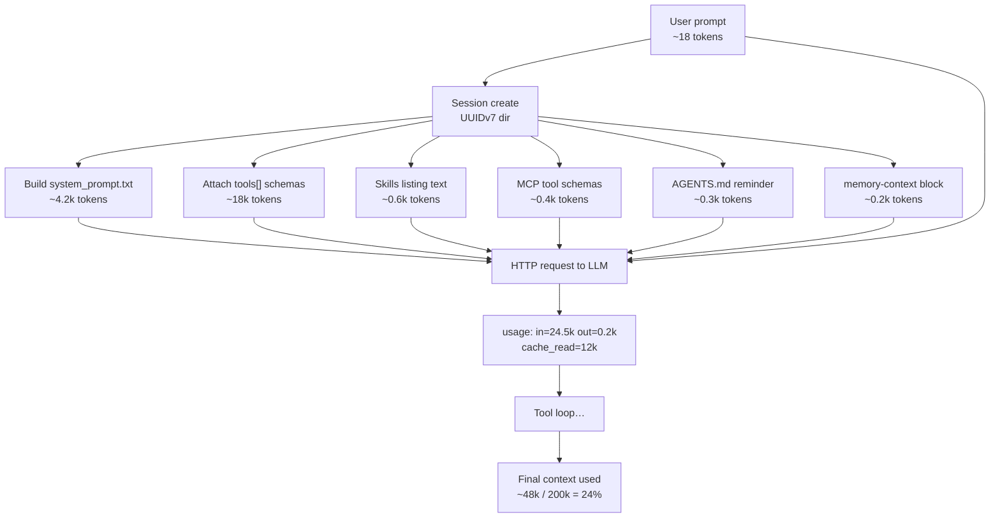
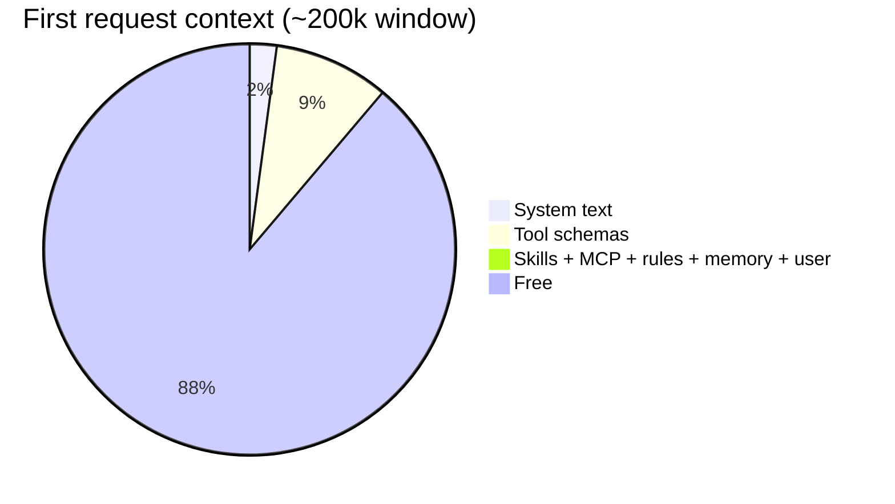
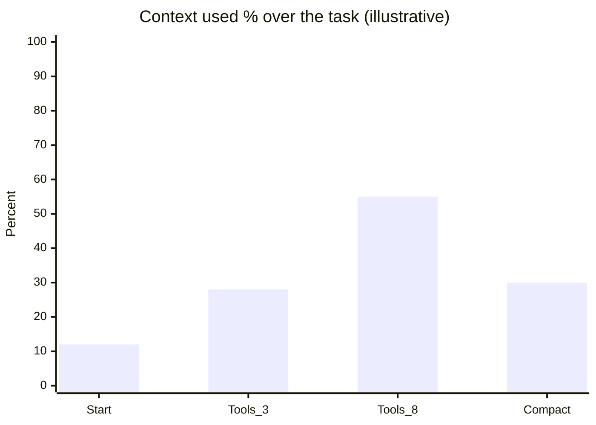

# Prompt journey: real texts, tokens, and final context length

This is the **concrete** walkthrough. Not abstract boxes - actual strings,
injection points, and approximate token counts so anyone can understand
where context goes.

Author: Yuval Avidani (YUV.AI) · Logan CLI  
Inspect live: `/context` · `/stats` · session files under `~/.logan/sessions/`

---

## Scenario

You run:

```bash
cd ~/logan-cli
logan --route auto -p "Add a /stats command that prints token usage by model"
```

`--route auto` classifies this as **implementation** → `tier-default`
(e.g. Claude Sonnet). Memory is **on**. MCP Excalidraw is connected via
Grok Build website connectors. Skills include `self-improve`, `auto-route`.

---

## Visual pipeline (with sizes)



---

## Step 0 - Route (before any sample)

| Input | Output |
| --- | --- |
| Prompt text | `Add a /stats command that prints token usage by model` |
| Classifier | `route_auto::classify_route` |
| Decision | `tier-default` - "standard implementation / default tier" |
| CLI log | `logan: --route → model tier-default (...)` |

If you had typed `What does stats mean?`, route would pick `tier-fast`.

---

## Step 1 - Session artifacts created

```text
~/.logan/sessions/<encoded-cwd>/<session-id>/
  system_prompt.txt      ← full rendered system string
  prompt_context.json    ← structured assembler inputs
  chat_history.jsonl     ← conversation items
  updates.jsonl          ← resume log
```

You can open `system_prompt.txt` after any session - that is the truth of
what the model was told about identity and rules.

---

## Step 2 - System prompt text (what gets injected)

The model receives something like this (**abbreviated but real structure**):

```text
You are Logan, a coding agent CLI by Yuval Avidani (YUV.AI), forked from
xAI Grok Build. You are an autonomous agent that completes software
engineering tasks. Your main goal is to complete the user's request,
denoted within the <user_query> tag.

When long-term memory is available, use it to honor the user's preferences
and past lessons (what worked / what failed). Prefer durable improvements
via memory over repeating the same mistakes.

<action_safety>
Weigh each action by how easily it can be undone and how far its effects
reach. Local, reversible work such as editing files and running tests is
fine to do freely. Before executing any actions that are hard to reverse,
reach shared external systems, or are otherwise risky or destructive,
check with the user first.
...
</action_safety>

<tool_calling>
- Use specialized tools instead of bash when possible (e.g., `read_file`
  for reading files, `search_replace` for editing). Reserve bash for
  real shell operations.
</tool_calling>

<background_tasks>
For watch processes… Use the `monitor` tool…
</background_tasks>

<output_efficiency>
- Write like an excellent technical blog post…
</output_efficiency>

<formatting>
Your text output is rendered as GitHub-flavored markdown…
</formatting>

## Skills
- auto-route: Recommend a token-saving model tier…
- self-improve: Hermes-style reflection…
- learn-user: Extract and store preferences…
- check-work: Verify changes…
(…more skills with one-line descriptions only…)

## Memory
You have memory_search and memory_get tools. Use them when past decisions
or preferences might help.
```

### Token estimate for this layer

| Piece | ~Chars | ~Tokens (chars/4) |
| --- | --- | --- |
| Identity + memory note | 450 | 110 |
| action_safety | 1,800 | 450 |
| tool_calling + background | 900 | 225 |
| output_efficiency + formatting | 700 | 175 |
| Skills catalog (20 skills) | 2,400 | 600 |
| Memory tool instructions | 400 | 100 |
| **System text total** | **~6.7k** | **~1.7–2.5k** |

Real sessions are often **3–6k system tokens** depending on skill count and
template features. See live: `/context` → "System prompt".

---

## Step 3 - Not in system string: tool schemas (the big fixed cost)

The API also gets a separate `tools` array (JSON schemas for every tool).
Example (one tool only):

```json
{
  "type": "function",
  "function": {
    "name": "search_replace",
    "description": "Performs exact string replacements in files…",
    "parameters": {
      "type": "object",
      "properties": {
        "file_path": { "type": "string" },
        "old_string": { "type": "string" },
        "new_string": { "type": "string" },
        "replace_all": { "type": "boolean" }
      },
      "required": ["file_path", "old_string", "new_string"]
    }
  }
}
```

With **30–60 tools** (edit, shell, MCP, skills, …) this often dominates:

| Piece | ~Tokens |
| --- | --- |
| Built-in tool schemas | 12,000–25,000 |
| MCP tools (e.g. Excalidraw) | 200–2,000 |
| **Tools total** | **~14k–27k** |

`/context` shows this as **Tool definitions · N tools**.

---

## Step 4 - Project instructions (AGENTS.md)

Injected as a **user** (or synthetic reminder) message, not always system:

```text
<project_instructions>
# Global preferences - Yuval Avidani
## Writing style: single hyphen, never em/en-dash
...
</project_instructions>
```

| Piece | ~Tokens |
| --- | --- |
| AGENTS.md / Claude.md stack | 200–2,000 (yours may be larger) |

---

## Step 5 - Memory inject (first turn)

When memory is enabled and search hits:

```text
<memory-context>
## Preferences
- Writing: plain hyphen `-` only
- Confirm before force-push / shared systems

## Lessons
- Prefer `cargo check -p <crate>` over full workspace builds
</memory-context>
```

| Piece | ~Tokens |
| --- | --- |
| memory-context block | 50–800 |

---

## Step 6 - Your prompt lands

```text
<user_query>
Add a /stats command that prints token usage by model
</user_query>
```

| Piece | ~Tokens |
| --- | --- |
| User query | ~15–25 |

---

## Step 7 - First request: total context length

**Before any tool results** (illustrative, 200k model):

| Bucket | ~Tokens | % of 200k |
| --- | --- | --- |
| System prompt text | 4,200 | 2.1% |
| Tool schemas | 18,000 | 9.0% |
| Skills listing (in system or category) | 600 | 0.3% |
| MCP tool schemas | 400 | 0.2% |
| AGENTS.md | 300 | 0.15% |
| Memory-context | 200 | 0.1% |
| User prompt | 20 | ~0% |
| **Used** | **~23,720** | **~12%** |
| **Free** | **~176,280** | **~88%** |



Provider may also report **cache_read** if the system/tools prefix was cached
from a prior call (huge savings on tool-loop turns 2+).

Example usage object after first completion:

```json
{
  "prompt_tokens": 24500,
  "completion_tokens": 180,
  "cached_prompt_tokens": 12000,
  "reasoning_tokens": 0
}
```

Meaning: ~12k of the 24.5k input was billed as cache read (cheaper), not full
fresh input.

---

## Step 8 - Tool loop grows the window

Each tool result is appended to **messages** and re-sent (or cache-hit):

```text
assistant: tool_call read_file(slash/commands/mod.rs)
user: tool_result  … 400 lines …
assistant: tool_call search_replace(...)
user: tool_result ok
assistant: tool_call run_terminal_command(cargo check -p xai-grok-pager)
user: tool_result … compile output …
```

| After N tool rounds | ~Used | Notes |
| --- | --- | --- |
| 0 | 24k | first call |
| 3 | 35–45k | file reads |
| 8 | 70–90k | large tool outputs |
| >50% | prune old tool results | soft trim |
| >85% | auto-compact | summarize history |



---

## Step 9 - After the task: `/stats` and `/context`

```text
/context
  → window composition (system / messages / tools / free)

/stats
  → session API usage:
    Input: 91200 · Output: 6400 · Cache read: 48000 · Reasoning: 0
    By model:
      - tier-default: in=91200 out=6400 cache=48000 calls=9
    Est. cost: $… (if provider reports)
```

Ledger is filled every sample via `record_model_call_usage` (already in
harness). Headless JSON also surfaces `usage` when the provider returns it.

---

## How to reproduce and see the real files

```bash
# 1) Run a headless task with routing
logan --route auto -p "Explain route_auto.rs in 5 bullets" \
  --output-format json -m tier-fast   # or omit -m to use route

# 2) Find latest session
ls -lt ~/.logan/sessions/*/* | head

# 3) Read the exact system prompt
# cat ~/.logan/sessions/<cwd-enc>/<id>/system_prompt.txt | head -80
# cat ~/.logan/sessions/<cwd-enc>/<id>/prompt_context.json | head

# 4) In TUI after a real session
/context
/stats
/session-info
```

Helper:

```bash
examples/scripts/dump-prompt-journey.sh
```

---

## One-sentence mental model

**System prompt = identity + rules + skill names; tools[] = full schemas (biggest
fixed cost); messages = AGENTS + memory + your prompt + tool transcript;
`/context` = window pie; `/stats` = API spend by model; route auto = which
brain pays for it.**

---

## Related code

| Artifact | Path |
| --- | --- |
| System template | `crates/codegen/xai-grok-agent/templates/prompt.md` |
| Assembler | `PromptContext` / `AgentBuilder` |
| Route classifier | `xai_grok_shell::route_auto` |
| Usage ledger | `xai_chat_state::UsageLedger` |
| Session dump | `system_prompt.txt`, `prompt_context.json` |
