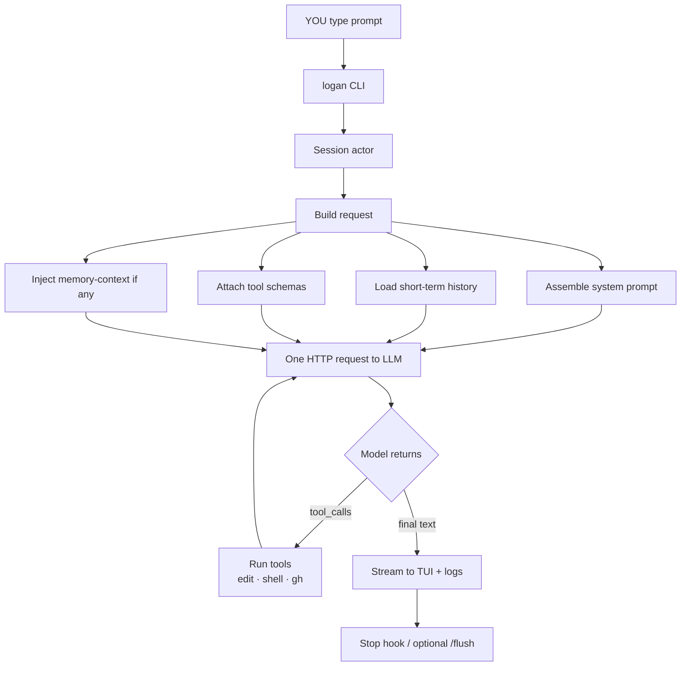
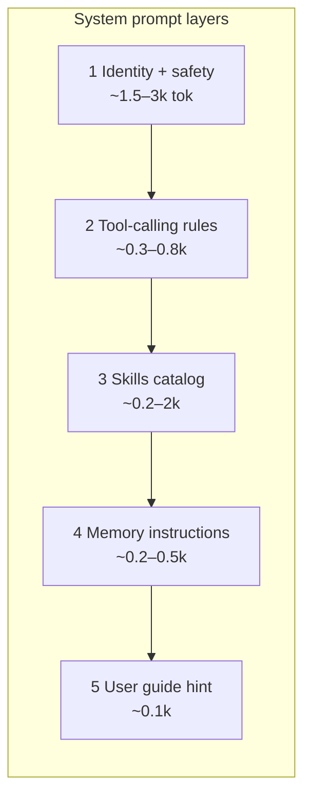
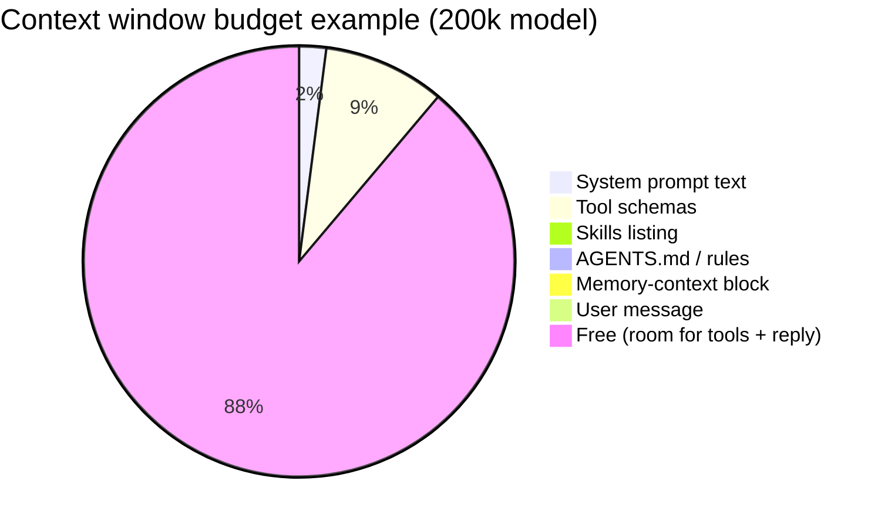
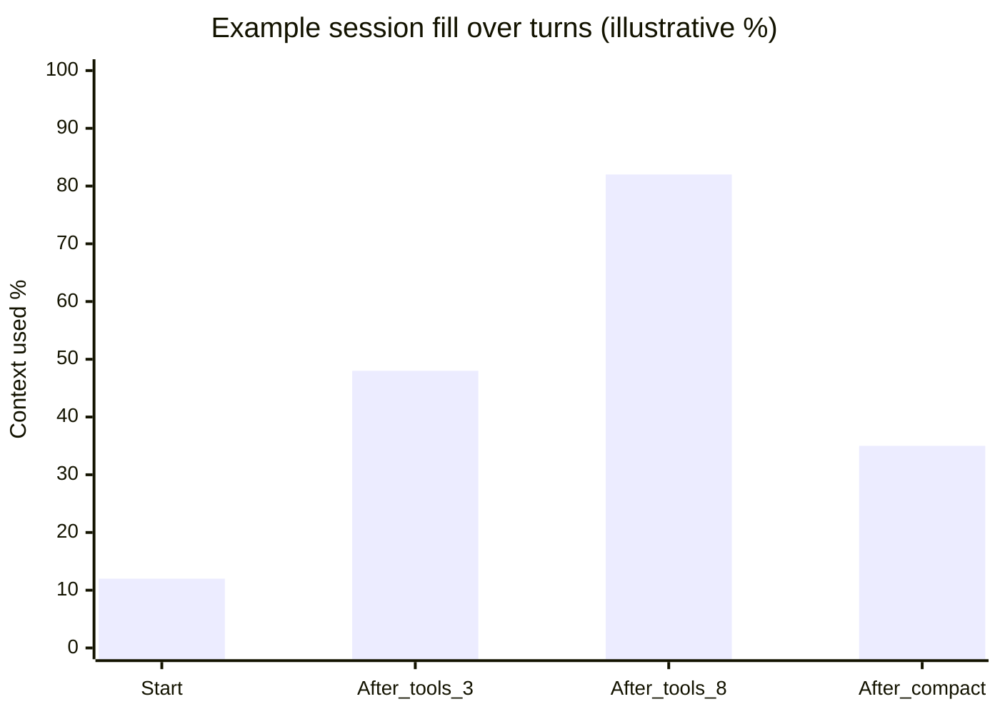
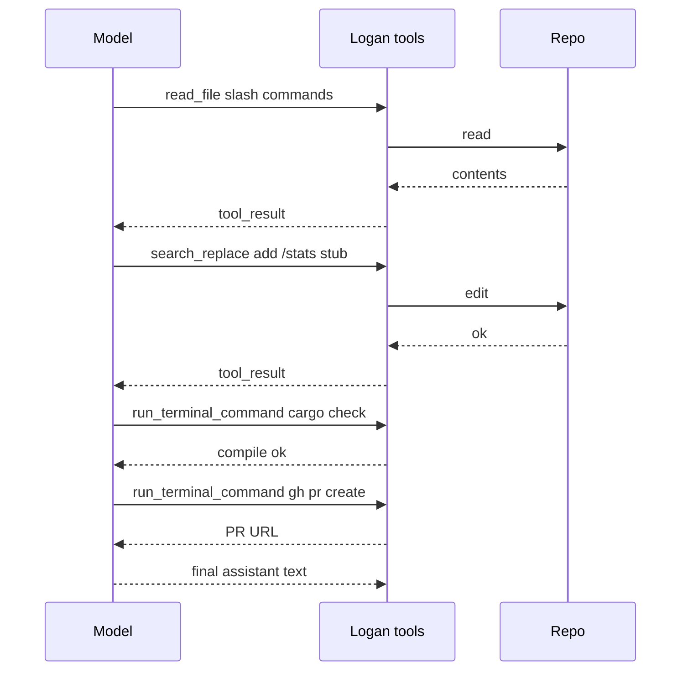

# Prompt journey walkthrough (real example)

**Goal:** show *exactly* what happens when you send one prompt - how the
system prompt is built, what fills the context window, and where tokens go.

Author: Yuval Avidani (YUV.AI) · https://yuv.ai  
Product: Logan (inspired by Wolverine - claws out for hard bugs)

---

## The example task

You open Logan in `~/logan-cli` and type:

```text
Add a /stats slash stub that prints "coming soon" and open a PR draft.
```

Model: `tier-default` (e.g. Claude Sonnet) · memory **on** · skills available.

---

## Big picture (visual)



---

## Step by step with *what is inside*

### Step 1 - You type

| Field | Value |
| --- | --- |
| cwd | `/Users/you/logan-cli` |
| session | new UUIDv7 under `~/.logan/sessions/<encoded-cwd>/<id>/` |
| prompt chars | ~90 |

Nothing is sent to the model yet - only local session state is prepared.

---

### Step 2 - CLI + session

Logan resolves:

- model id + API backend (`messages` / `chat_completions` / `responses`)
- permission mode, sandbox
- slash rewrite (none - this is a plain user message)
- optional skill rewrite (none unless you invoked `/skill …`)

---

### Step 3 - System prompt is **assembled** (not one fixed string forever)



#### Layer 1 - identity (excerpt of what the model sees)

```text
You are Logan, a coding agent CLI by Yuval Avidani (YUV.AI), forked from
xAI Grok Build. You are an interactive CLI tool that helps users with
software engineering tasks. Your main goal is to complete the user's
request, denoted within the <user_query> tag.

When long-term memory is available, use it to honor the user's preferences
and past lessons...

<action_safety>
Weigh each action by how easily it can be undone...
</action_safety>
```

#### Layer 2 - tool rules (excerpt)

```text
<tool_calling>
- Use specialized tools instead of bash when possible
  (e.g. read_file, search_replace) ...
</tool_calling>
```

#### Layer 3 - skills catalog (names + short descriptions only)

```text
## Skills
- self-improve: Hermes-style reflection...
- learn-user: extract preferences...
- auto-route: recommend model tier...
- check-work: verification...
(…more discovered skills…)
```

Full skill bodies are **not** dumped into the system prompt - they load when
the skill tool runs.

#### Layer 4 - memory (when enabled)

Instructions to use `memory_search` / `memory_get`, plus optional first-turn:

```text
<memory-context>
## Preferences
- Writing: plain hyphen only
- Confirm before force-push

## Lessons
- Prefer cargo check -p <crate> over full workspace
</memory-context>
```

#### Not always in the system string

| Content | How it is attached |
| --- | --- |
| **AGENTS.md / rules** | Often synthetic **user** reminders, not only system |
| **Tool JSON schemas** | Separate `tools` array on the API request (big!) |
| **Prior turns** | Conversation array (short-term memory) |

---

### Step 4 - Context window anatomy (example numbers)

Numbers are **illustrative** (bytes÷4 style estimates). Real values vary by
model tokenizer and enabled tools. Check live with **`/context`**.



| Bucket | ~Tokens | Notes |
| --- | --- | --- |
| System prompt text | 3–6k | Identity, safety, catalogs |
| **Tool schemas** | **10–40k** | Often the largest fixed cost |
| Skills listing | 0.2–2k | Names + descriptions only |
| Project rules | 0–5k | Your AGENTS.md size |
| Memory inject | 0–2k | First turn / post-compact |
| History | 0 → grows | Previous turns + tool results |
| **Free** | rest | Output + future tools |

After several tool rounds, history balloons - Logan **prunes** old tool
results near ~50% and **auto-compacts** near ~85%.



---

### Step 5 - First model call (request shape)

Conceptual JSON (simplified):

```json
{
  "model": "claude-sonnet-4-5",
  "system": "<assembled Logan system prompt…>",
  "messages": [
    { "role": "user", "content": "<project-instructions>…AGENTS.md…</project-instructions>" },
    { "role": "user", "content": "<user_query>\nAdd a /stats slash stub…\n</user_query>" }
  ],
  "tools": [ { "name": "read_file", "…" : "…" }, { "name": "search_replace" }, "…" ]
}
```

Provider returns usage (when available):

```json
{
  "input_tokens": 24500,
  "output_tokens": 180,
  "cache_read_input_tokens": 12000,
  "cache_creation_input_tokens": 800
}
```

**Cache** tokens: repeated system/tool prefix often hits provider prompt cache -
that is why stable system prompts matter for cost.

---

### Step 6 - Tool loop (still one "journey")



Each tool round **re-sends** (or cache-hits) system + tools + growing history.
That is why long tool transcripts get expensive - and why pruning/compaction
exist.

---

### Step 7 - What you see vs what is stored

| Surface | Content |
| --- | --- |
| TUI stream | Model text + tool cards |
| `updates.jsonl` | Resume/event log |
| `chat_history.jsonl` | Model-facing history |
| `/context` | Live composition estimate |
| Stop hook | Reflection stub → MEMORY.md |
| Optional `/flush` | Rich long-term summary |

---

## How to inspect this yourself

```bash
# Live composition
/context
/session-info

# Headless with usage JSON
logan -p "Explain main.rs in 3 bullets" --output-format json -m tier-fast

# After agent-style calls
python3 examples/scripts/usage-rollup.py --by-model
```

Architects: `PromptContext` in `xai-grok-agent` is the structured assembler;
`Agent::system_prompt()` holds the rendered string.

---

## Mental model (one sentence)

**System prompt = who Logan is + how to use tools; tools array = what Logan can
do; messages = the job + history; memory = durable lessons; compaction = keep
the window livable.**

---

## Related

- [architecture/ARCHITECTURE.md](architecture/ARCHITECTURE.md)
- [MODEL_ROUTING.md](MODEL_ROUTING.md) - per skill / subagent models
- [AUTOMATIONS.md](AUTOMATIONS.md) - schedules, cron, wake
- [FEATURES.md](FEATURES.md)
