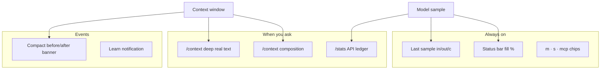

# Token visibility - see exactly what you are spending

**Author:** Yuval Avidani (YUV.AI) · https://yuv.ai

Logan is built so you **never guess** where tokens went. Three layers answer:

1. **How full is the window right now?** (live status bar)  
2. **What did the API bill this session?** (`/stats` - in / out / cache / $)  
3. **What text is actually in the window?** (`/context deep` - real system prompt + messages)

---

## Why this matters

Agent CLIs hide cost until the bill arrives. Logan surfaces:

| Question | Answer |
| --- | --- |
| Am I about to compact? | Status bar % + `!` near threshold |
| What did the last model call cost in tokens? | `in / out / c` on the bar after every sample |
| Input vs cache vs reasoning this session? | `/stats` color ledger |
| Is the system prompt eating the window? | `/context` composition bar |
| **What words** are those tokens? | `/context deep` text previews |
| Did compact free space? | Banner: `Compacted 90K → 24K (saved 66K)` |

---

## Layer 1 - Live status bar (always on)

No command needed. After each sample (and mid-tool-loop window updates):

```text
m grok-4.5 · s grok-search · mcp 3     24K / 200K 12% · in 2.4K out 180 c 1.2K
│                                      │              │
│ dual-stack chips                     │ window fill  │ last sample API usage
```

| Chip | Meaning |
| --- | --- |
| `m …` | Coding model |
| `s …` | Web-search model when configured and different |
| `mcp N` | Connected MCP servers |
| `24K / 200K 12%` | Used / total context window + fill % (color tracks pressure) |
| `in / out / c` | Last-turn **input · output · cache read** tokens |
| `!` | Near auto-compact threshold |

**Hover** the context chip for composition:

```text
sys 4.2K · msg 18K · tools 14K · free 163K · last in 2.4K out 180 cache 1.2K · compact@85%
```

---

## Layer 2 - `/stats` (API ledger, colorful)

```text
/stats
```

Renders a high-contrast block (not gray system mush):

| Color | Field |
| --- | --- |
| **Teal bold** | **IN** - prompt / input tokens billed |
| **Green bold** | **OUT** - completion tokens |
| **Violet bold** | **CACHE** - cache read (cheap reuse) |
| **Amber bold** | **REASON** - reasoning tokens when reported |
| **Brand accent** | **$** - estimated cost when provider ticks allow |

Also: model call counts, **by-model** breakdown, last-sample chip, tip to `/context deep`.

Aliases: `/tokens`, `/token-stats`. Same data is embedded in `/session-info`.

---

## Layer 3 - `/context` and `/context deep` (window + text)

### Composition bar

```text
/context
```

- Categorical diamond bar (system · messages · reasoning · free)  
- Legend: System prompt, Messages, Tool definitions, Skills, MCP servers  
- Auto-compact line + remaining tokens until cliff  
- Tips for deep dive and `/stats`

### Deep dive - the actual text

```text
/context deep
```

(aliases: `/context full`, `/context sys`, `/ctx`, `/window`)

Loads from the session directory:

| File | Content |
| --- | --- |
| `system_prompt.txt` | Full system prompt the model saw |
| `chat_history.jsonl` | User / assistant / reasoning / tool messages |

Then shows color-coded sections:

```text
── Deep dive (actual window text) ──
est. N chars · ~tokens (chars/4)

▸ System prompt (system_prompt.txt)  ·  4.1k chars  ·  ~1k tok
  You are …

▸ #1 user  ·  …
  <user_query>…

▸ #2 assistant  ·  …
```

Long blobs are truncated with a pointer to the full file path.  
**est. tokens** use chars/4 for inspection - **API billable** counts stay on `/stats`.

---

## Layer 4 - Compaction honesty

When auto-compact fires:

```text
Compacting context (87% full)…
Compacted 90K → 24K (saved 66K) in 1.2s
```

You always see **before → after + saved**.

---

## Layer 5 - Outside the TUI

| Tool | What |
| --- | --- |
| `examples/scripts/dump-prompt-journey.sh` | Dump latest `system_prompt.txt` + sizes |
| `examples/scripts/logan-call.sh` | Headless call → `~/.logan/stats/usage.jsonl` |
| `examples/scripts/usage-rollup.py` | Aggregate jsonl by day/model |
| Headless `--output-format json` | `usage` when the provider returns it |
| OTEL metrics | `input` / `output` / `reasoning` / `cache_read` |

---

## Mental model



---

## Quick recipe

```bash
logan
# … run a turn …
/stats            # what did we bill?
/context          # how is the window composed?
/context deep     # read the actual system prompt + messages
```

Never fly blind. Claws out.
