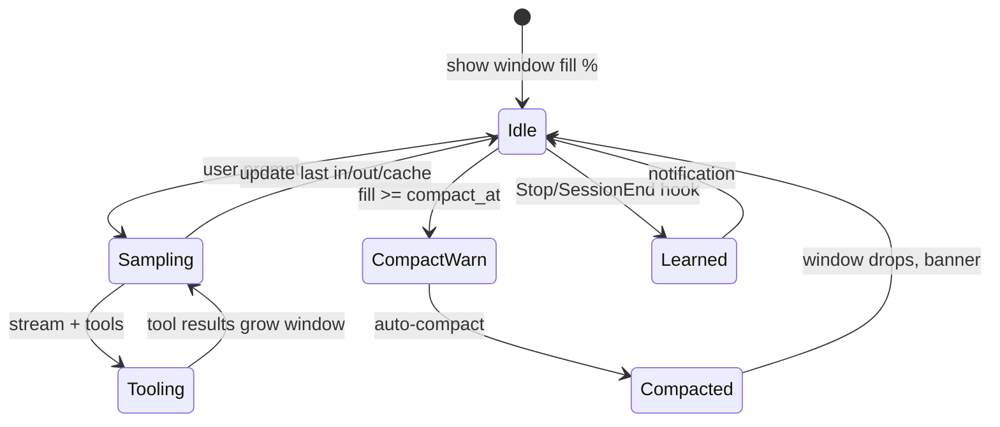

# Logan TUI UX vision - best-in-class agent CLI

Author: Yuval Avidani (YUV.AI) · claws out for hard bugs

---

## Principles

1. **Never hide cost** - tokens and context are always glanceable  
2. **Never surprise compaction** - warn before the cliff  
3. **Learning is visible** - when memory/hooks fire, tell the human  
4. **Online tools are honest** - show which brain searched the web  
5. **Dual-stack is normal** - Claude for code, Grok for search, MCP for systems  

---

## Live status bar (shipping direction)

| Element | Default | Hover / expand |
| --- | --- | --- |
| **Context** | `24K / 200K 12% · in 2.4K out 180 c 1.2K` (+ `!` near compact) | `sys · msg · tools · free · last in/out/cache · compact@85%` |
| **Credits** | product bar when applicable | manage/top-up |
| **Queue** | `+N` | open queue |
| **Goal** | live goal tokens | goal detail |
| **MCP** | init progress | server list |

Implemented now:

- Context bar always shows **percentage** + last-turn **in / out / cache**  
- Mid-tool-loop window fill updates the live **in** chip  
- Near auto-compact threshold shows **`!`**  
- Hover shows **composition + last-call usage** when known  
- **`/stats`** colorful ledger (IN/OUT/CACHE/REASON/$)  
- **`/context deep`** actual system prompt + message texts  
- Dual-stack chips **`m · s · mcp`**  
- Compact banner **before → after (saved N)**  
- Auto-reflect hook **desktop/OSC notification** when it writes MEMORY.md  

**Deep guide:** [TOKEN_VISIBILITY.md](TOKEN_VISIBILITY.md)

---

## Notifications matrix

| Event | UX |
| --- | --- |
| Turn complete | existing OS notification hooks |
| Approval required | existing |
| **Learned (auto-reflect)** | OSC + macOS notification from hook |
| Compaction started / done | toast + context bar color jump |
| Route auto selected model | stderr line on headless; toast in TUI (planned) |
| Web search used | tool card + optional “via grok-search model” chip |

---

## Dual-stack status chip (shipped)

```text
m claude-sonnet · s grok-search · mcp 3
```

Config: `[models] default` + `web_search`. See [WEB_SEARCH.md](WEB_SEARCH.md) and
the full token story in [TOKEN_VISIBILITY.md](TOKEN_VISIBILITY.md).

---

## “As we work” token story



---

## Roadmap (think bigger)

| Horizon | Features |
| --- | --- |
| **Now** | % context bar, live last-turn in/out/cache every sample (incl. mid-tool window fill), hover detail, `/stats`, learn notify, web docs |
| **Now** | Dual-stack status chips: `m <model> · s <search> · mcp N` |
| **Now** | Inline compaction banner with before → after + saved tokens |
| **Now** | Auto skills from `~/.logan` + `~/.grok` + claude/cursor/agents; auto MCP from config + `.mcp.json` + cursor/claude |
| **Later** | Sparkline of context over turns; cost estimate live; pin "always show breakdown" |
| **Later** | Sound design for learn/compact (opt-in); theme packs (adamantium) |

---

## How to feel the current UX

```bash
# rebuild
cargo build -p xai-grok-pager-bin --release && cp target/release/logan ~/.local/bin/

# dual stack coding + search (if you have both keys)
# see docs/WEB_SEARCH.md

logan
# after a few turns:
#   watch status bar fill % change color
#   hover context for sys/msg/tools/free
#   /stats for API ledger
# quit → learn notification from auto-reflect hook
```
