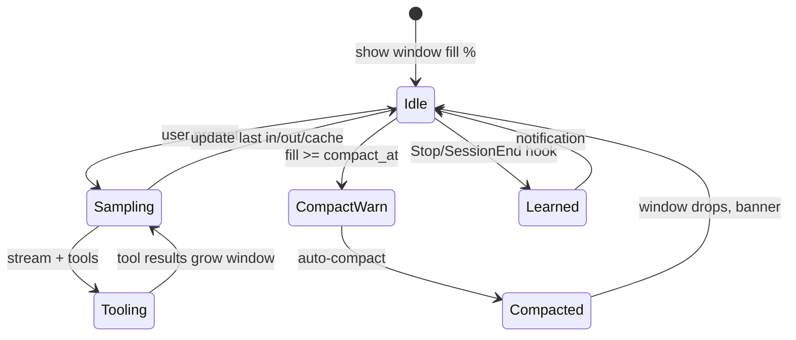

# Logan TUI UX vision - best-in-class agent CLI

Author: Yuval Avidani (YUV.AI) · claws out for hard bugs

---

## Principles

1. **Never hide cost** - tokens and context are always glanceable  
2. **Never surprise compaction** - warn before the cliff  
3. **Learning is visible** - when memory/hooks fire, tell the human  
4. **Online tools are honest** - show which brain searched the web  
5. **Dual-stack is normal** - Claude for code, Grok for search, MCP for systems  

---

## Live status bar (shipping direction)

| Element | Default | Hover / expand |
| --- | --- | --- |
| **Context** | `24K / 200K 12%` (+ ⚠ near compact) | `sys · msg · tools · free · compact@85% · last in/out/cache` |
| **Credits** | product bar when applicable | manage/top-up |
| **Queue** | `+N` | open queue |
| **Goal** | live goal tokens | goal detail |
| **MCP** | init progress | server list |

Implemented now:

- Context bar always shows **percentage**  
- Near auto-compact threshold shows **⚠**  
- Hover shows **composition + session API usage** when known  
- `/stats` full breakdown after turns  
- Auto-reflect hook **desktop/OSC notification** when it writes MEMORY.md  

---

## Notifications matrix

| Event | UX |
| --- | --- |
| Turn complete | existing OS notification hooks |
| Approval required | existing |
| **Learned (auto-reflect)** | OSC + macOS notification from hook |
| Compaction started / done | toast + context bar color jump |
| Route auto selected model | stderr line on headless; toast in TUI (planned) |
| Web search used | tool card + optional “via grok-search model” chip |

---

## Dual-stack status chip (planned UI)

```text
model claude-sonnet · search grok-search · mcp 3 · mem on
```

Config already supports separate `default` and `web_search` models.

---

## “As we work” token story



---

## Roadmap (think bigger)

| Horizon | Features |
| --- | --- |
| **Now** | % context bar, hover detail, `/stats`, learn notify, web docs |
| **Next** | Live last-turn in/out/cache every sample (wire usage meta to UI) |
| **Next** | Inline compaction banner with before/after tokens |
| **Next** | Dual-stack model chips in status bar |
| **Later** | Sparkline of context over turns; cost estimate live; pin “always show breakdown” |
| **Later** | Sound design for learn/compact (opt-in); theme packs (adamantium) |

---

## How to feel the current UX

```bash
# rebuild
cargo build -p xai-grok-pager-bin --release && cp target/release/logan ~/.local/bin/

# dual stack coding + search (if you have both keys)
# see docs/WEB_SEARCH.md

logan
# after a few turns:
#   watch status bar fill % change color
#   hover context for sys/msg/tools/free
#   /stats for API ledger
# quit → learn notification from auto-reflect hook
```
