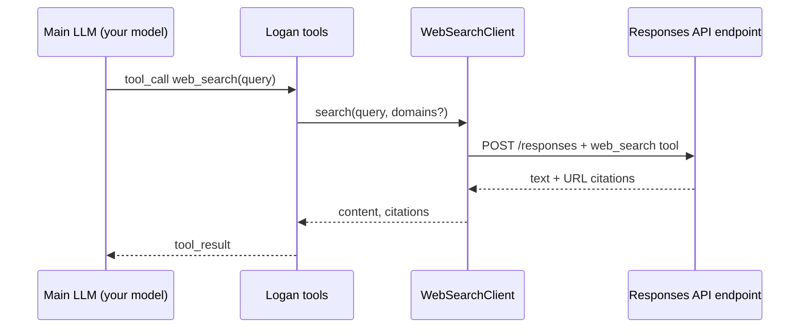
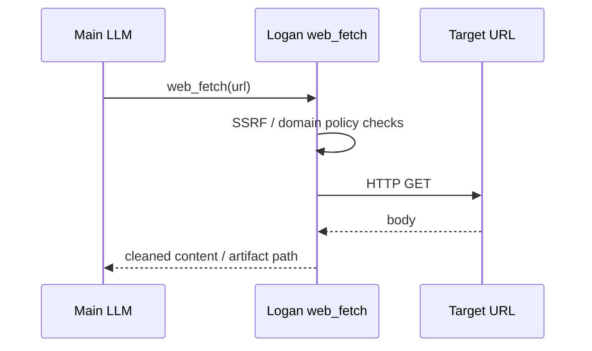

# How Grok Build / Logan fetches the web

Author: Yuval Avidani (YUV.AI) · Logan CLI

---

## Short answer

Logan inherits **two complementary online paths** from Grok Build:

| Path | What it is | How it hits the network |
| --- | --- | --- |
| **`web_search` tool** | Agent decides to search | Client calls an HTTP **Responses API** with a `web_search` tool payload (via `WebSearchClient`) |
| **`web_fetch` tool** | Agent fetches a URL | Client HTTP GET (with SSRF guards, cache, domain policy) |
| **Backend search** (optional) | Model-side search on xAI/Grok Responses | When the active model sets `supports_backend_search = true`, the **main sampler** request can include hosted web search and the local `web_search` tool is filtered out |

So “online” is **not** magic browser automation - it is **tools + (sometimes) model-hosted search**.

---

## Path A - `web_search` tool (client-side)



### Code

- Tool: `crates/codegen/xai-grok-tools/.../web_search/mod.rs`
- Client: `implementations/web_search/client.rs` - builds Bearer auth, posts to
  OpenAI-style **Responses** API with `WebSearchToolArgs`
- Config model for search: `[models] web_search = "…"` (default was multi-agent
  Grok search model when on xAI stack)

### What Logan does today

Same tool. The **endpoint + key** depend on how you configure models:

1. **Default Grok Build stack** - chat proxy / xAI API + session OAuth or `XAI_API_KEY`  
2. **Custom LLM only** - main chat can be Anthropic/OpenAI/Ollama, but **web_search
   still needs a Responses-capable endpoint** that supports web search  
3. **LiteLLM / OpenRouter** - only if that gateway implements Responses + web search
   for the configured `web_search` model

If `WebSearchClient` is not inserted into tool resources (disabled config), the
tool errors with “missing required resource”.

### Configure search model

```toml
[models]
default = "tier-default"          # your coding model (any backend)
web_search = "grok-4.20-multi-agent"  # or another Responses+search model

[model.grok-4.20-multi-agent]
# only if you still have xAI credentials for search
base_url = "https://api.x.ai/v1"  # example - use your real endpoint
env_key = "XAI_API_KEY"
```

Or disable client search and rely on fetch + your own MCP:

```bash
logan -p "…" --disallowed-tools "web_search"
```

---

## Path B - `web_fetch` tool



Independent of Responses web search. Uses Logan’s HTTP stack with safety
filters. Config: `GROK_WEB_FETCH=0` to disable; `[toolset.web_fetch]` for policy.

---

## Path C - Backend / hosted search

When the **main model** supports it (`supports_backend_search = true` on the
catalog entry), the sampler may attach server-side web search to the primary
completion. In that mode the local `web_search` tool is often **omitted** from
the tool list so the model does not double-search.

This is primarily an **xAI / Grok Responses** feature. Custom Anthropic Messages
or Ollama models typically **do not** get backend search unless your proxy
implements it.

---

## Can Logan use Grok Build *and* another LLM provider?

**Yes - that is a first-class dual-stack setup.**

```text
┌─────────────────────────────────────────────────────────┐
│  Logan CLI                                              │
│                                                         │
│  Main agent loop  ──chat_completions/messages──► Claude │
│       │                    or OpenAI / Ollama / LiteLLM │
│       │                                                 │
│       ├── web_search tool ──Responses+search──► xAI/Grok│
│       ├── web_fetch ──────────────────────────► public web
│       └── MCP (Excalidraw, GH, …) ────────────► connectors
└─────────────────────────────────────────────────────────┘
```

### Practical config pattern

```toml
[models]
default = "claude-sonnet"           # coding brain
web_search = "grok-search"          # Grok search brain
session_summary = "tier-fast"

[model.claude-sonnet]
model = "claude-sonnet-4-5"
base_url = "https://api.anthropic.com/v1"
api_backend = "messages"
env_key = "ANTHROPIC_API_KEY"
extra_headers = { "anthropic-version" = "2023-06-01" }
context_window = 200000

[model.grok-search]
model = "grok-4.20-multi-agent"     # whatever xAI search model you have
base_url = "https://api.x.ai/v1"
env_key = "XAI_API_KEY"
# Responses API expected for WebSearchClient
```

Auth:

- Coding model: Anthropic / OpenAI / etc.  
- Search: `XAI_API_KEY` or `logan login` OAuth for xAI stack  
- Or put **both** behind **LiteLLM** with different model names  

MCP connectors (including Excalidraw from **Grok Build website connectors**)
attach independently of which chat model you use.

---

## Sandbox / network

- Profiles like `workspace` still allow network for LLM API, `web_search`,
  `web_fetch`, and MCP (see sandbox user guide).  
- Permissions can deny `web_search` / `WebFetch(...)` rules.  

---

## Logan UX for “online” work

When the agent searches, you already see tool cards in the TUI. Best practice:

1. Prefer `web_search` for discovery  
2. Prefer `web_fetch` for a known URL  
3. Use MCP for structured APIs (GitHub, docs systems)  
4. Watch `/stats` - search calls cost **separate** model tokens on the search model  

---

## Related

- [MODEL_ROUTING.md](MODEL_ROUTING.md) - which model for search vs chat  
- [PROMPT_JOURNEY_WALKTHROUGH.md](PROMPT_JOURNEY_WALKTHROUGH.md) - where tools sit in context  
- User guide custom models / sandbox  
